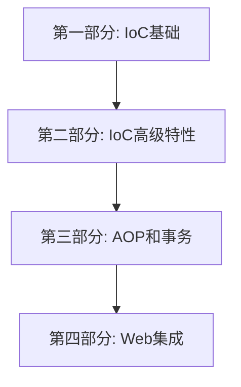

# Mini-Spring Framework


## 项目简介
Mini-Spring 是一个简化版的 Spring 框架，旨在帮助开发者深入理解 Spring 的核心原理和实现机制。本项目采用问题驱动的方式，通过实现核心功能模块，让学习者能够深入理解 Spring 的设计思想和实现原理。每一章都会从实际问题出发，分析现有方案的不足，然后一步步实现解决方案。

## 学习路线图


## 学习建议
1. 按照顺序阅读，每个章节都建立在前面章节的基础之上
2. 动手实践每个章节的代码示例
3. 理解每章提出的问题和解决思路
4. 完成每个章节后的练习题
5. 使用调试工具跟踪代码执行流程

## 项目结构
```
mini-spring
├── src/main/java/org/minispring
│   ├── beans           // IoC容器核心实现
│   ├── context         // 应用上下文
│   ├── aop             // AOP实现
│   ├── tx              // 事务管理
│   ├── web             // Web MVC实现
│   └── core            // 核心工具类
├── src/test/java       // 测试用例
└── docs               
    └── tutorials       // 教程文档
```

## 教程目录

### 第一部分：IoC基础
#### [第1章：为什么需要IoC容器？](docs/tutorials/01-why-ioc-container.md)
- 问题引入：传统开发方式的困境
- IoC和DI的核心概念解析
- 设计一个最简单的容器
- 实现控制反转的核心步骤
- 练习：手写简单IoC容器

#### [第2章：Bean的定义与注册](docs/tutorials/02-bean-definition.md)
- 问题引入：如何描述和管理Bean？
- BeanDefinition的设计与实现
- Bean的命名与别名机制
- Bean定义的注册与获取
- 练习：实现BeanDefinition体系

#### [第3章：Bean的生命周期管理](docs/tutorials/03-bean-lifecycle.md)
- 问题引入：Bean是如何被创建和销毁的？
- Bean的完整生命周期图解
- 实例化策略的设计与实现
- 初始化和销毁机制的实现
- 作用域的实现
- 练习：实现Bean生命周期管理

#### [第4章：依赖注入的实现](docs/tutorials/04-dependency-injection.md)
- 问题引入：如何实现依赖注入？
- 依赖注入的实现原理
- 构造器注入与setter注入
- 循环依赖的解决方案
  - 三级缓存机制的设计与实现
  - setter注入循环依赖的处理
  - 构造器注入循环依赖的检测与预防
  - 缓存机制的优化与改进
- 类型转换系统的设计
- 练习：实现基础的依赖注入

### 第二部分：IoC高级特性
#### [第5章：统一资源加载](docs/tutorials/05-resource-loading.md)
- 问题引入：如何统一管理资源？
- Resource抽象的设计
- 配置文件的加载与解析
- 资源加载器的实现
- 练习：实现配置文件加载

#### [第6章：应用上下文设计](docs/tutorials/06-application-context.md)
- 问题引入：为什么需要ApplicationContext？
- BeanFactory与ApplicationContext
- 事件机制的设计与实现
- 国际化支持的实现
- 练习：实现简单的应用上下文

### 第三部分：AOP和事务
#### [第7章：AOP的设计与实现](docs/tutorials/07-aop-implementation.md)
- 问题引入：如何实现面向切面编程？
- AOP的核心概念和原理
- 动态代理的实现方案
- 切点表达式的设计
- AspectJ表达式支持
- PointcutParser的正确使用
- 切点原语(Primitive)的配置
- 通知的织入过程
- 练习：实现简单的AOP功能

#### [第8章：声明式事务实现](docs/tutorials/08-transaction-management.md)
- 问题引入：如何优雅地管理事务？
- 事务管理器的设计
- 事务传播行为的实现
- 事务隔离级别的支持
- 事务同步管理器
- 练习：实现基础事务管理

### 第四部分：Web集成
#### [第9章：Spring MVC的实现](docs/tutorials/09-spring-mvc.md)
- 问题引入：Web开发的困境
- DispatcherServlet的设计与实现
- HandlerMapping的实现
- HandlerAdapter的实现
- ViewResolver的设计
- 统一异常处理机制
- 练习：实现基础的MVC框架

#### [第10章：Spring扩展机制](docs/tutorials/10-extension-mechanism.md)
- 问题引入：框架扩展的困境
- BeanFactoryPostProcessor的实现
- BeanPostProcessor的应用
- ImportBeanDefinitionRegistrar的使用
- 条件注解的实现原理
- 练习：实现自定义扩展点

#### [第11章：Spring集成机制](docs/tutorials/11-spring-integration.md)
- 问题引入：框架集成的困境
- 自动配置机制的实现
- 服务注册发现的设计
- 负载均衡的实现
- 熔断降级机制
- 练习：实现基础的服务治理

## 环境要求
- JDK 1.8+
- Maven 3.6+
- IDE（推荐IntelliJ IDEA）

## 快速开始
```bash
git clone https://github.com/youngyangyang04/mini-spring.git
cd mini-spring
mvn clean install
```

## 文档约定
- 每章以实际问题开始
- 提供问题分析和解决思路
- 包含完整的代码实现
- 配有类图和时序图
- 提供与Spring的对比分析
- 包含相关面试题解答
- 提供实践练习题目
- 确保章节之间的连贯性
- 确保与教程目录保持一致
- 总结每章的核心内容

## 代码规范
- 遵循阿里巴巴Java开发规范
- 代码注释覆盖率不低于30%
- 所有代码均包含单元测试
- 统一的异常处理机制

## 学习成果
完成本教程后，你将：
1. 深入理解Spring核心原理
2. 掌握框架设计的关键技术
3. 提升架构设计能力
4. 能够回答相关面试题
5. 具备框架开发能力

## 推荐阅读
1. 《Spring源码深度解析》
2. 《Spring揭秘》
3. Spring官方文档

## 如何贡献
1. Fork 本仓库
2. 创建新的分支 `git checkout -b feature/your-feature`
3. 提交你的修改 `git commit -m 'Add some feature'`
4. 推送到分支 `git push origin feature/your-feature`
5. 创建 Pull Request

## 问题反馈
- 在GitHub Issues中提问
- 通过Pull Request贡献内容
- 查看文档中的常见问题解答

## 开源协议
本项目采用 MIT 协议开源，详见 [LICENSE](LICENSE) 文件。 