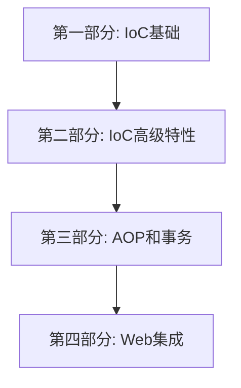

# Mini-Spring Framework


## 项目简介
Mini-Spring 是一个简化版的 Spring 框架，旨在帮助开发者深入理解 Spring 的核心原理和实现机制。本项目采用问题驱动的方式，通过实现核心功能模块，让学习者能够深入理解 Spring 的设计思想和实现原理。每一章都会从实际问题出发，分析现有方案的不足，然后一步步实现解决方案。

## 学习路线图


## 学习建议
1. 按照顺序阅读，每个章节都建立在前面章节的基础之上
2. 动手实践每个章节的代码示例
3. 理解每章提出的问题和解决思路
4. 完成每个章节后的练习题
5. 使用调试工具跟踪代码执行流程

## 项目结构
```
mini-spring
├── src/main/java/com/kama/minispring
│   ├── beans           // IoC容器核心实现
│   ├── context         // 应用上下文
│   ├── aop             // AOP实现
│   ├── tx              // 事务管理
│   ├── web             // Web MVC实现
│   ├── boot            // Spring Boot核心功能
│   ├── cloud           // Spring Cloud集成
│   ├── core            // 核心工具类
│   ├── stereotype      // 注解支持
│   └── util            // 通用工具类
├── src/test/java       // 测试用例
```

## 教程目录

### 第一部分：IoC基础
#### [第1章：为什么需要IoC容器？]
- 问题引入：传统开发方式的困境
- IoC和DI的核心概念解析
- 设计一个最简单的容器
- 实现控制反转的核心步骤
- 练习：手写简单IoC容器

#### [第2章：Bean的定义与注册]
- 问题引入：如何描述和管理Bean？
- BeanDefinition的设计与实现
- Bean的命名与别名机制
- Bean定义的注册与获取
- 练习：实现BeanDefinition体系

#### [第3章：Bean的生命周期管理]
- 问题引入：Bean是如何被创建和销毁的？
- Bean的完整生命周期图解
- 实例化策略的设计与实现
- 初始化和销毁机制的实现
- 作用域的实现
- 练习：实现Bean生命周期管理

#### [第4章：依赖注入的实现]
- 问题引入：如何实现依赖注入？
- 依赖注入的实现原理
- 构造器注入与setter注入
- 循环依赖的解决方案
- 三级缓存机制的设计与实现
- setter注入循环依赖的处理
- 构造器注入循环依赖的检测与预防
- 缓存机制的优化与改进
- 类型转换系统的设计
- 练习：实现基础的依赖注入

### 第二部分：IoC高级特性
#### [第5章：统一资源加载]
- 问题引入：如何统一管理资源？
- Resource抽象的设计
- 配置文件的加载与解析
- 资源加载器的实现
- 练习：实现配置文件加载

#### [第6章：应用上下文设计]
- 问题引入：为什么需要ApplicationContext？
- BeanFactory与ApplicationContext
- 事件机制的设计与实现
- 国际化支持的实现
- 练习：实现简单的应用上下文

### 第三部分：AOP和事务
#### [第7章：AOP的设计与实现]
- 问题引入：如何实现面向切面编程？
- AOP的核心概念和原理
- 动态代理的实现方案
- 切点表达式的设计
- AspectJ表达式支持
- PointcutParser的正确使用
- 切点原语(Primitive)的配置
- 通知的织入过程
- 练习：实现简单的AOP功能

#### [第8章：声明式事务实现]
- 问题引入：如何优雅地管理事务？
- 事务管理器的设计
- 事务传播行为的实现
- 事务隔离级别的支持
- 事务同步管理器
- 练习：实现基础事务管理

### 第四部分：Web集成
#### [第9章：Spring MVC的实现]
- 问题引入：Web开发的困境
- DispatcherServlet的设计与实现
- HandlerMapping的实现
- HandlerAdapter的实现
- ViewResolver的设计
- 统一异常处理机制
- 练习：实现基础的MVC框架

#### [第10章：Spring扩展机制]
- 问题引入：框架扩展的困境
- BeanFactoryPostProcessor的实现
- BeanPostProcessor的应用
- ImportBeanDefinitionRegistrar的使用
- 条件注解的实现原理
- 练习：实现自定义扩展点

#### [第11章：Spring集成机制]
- 问题引入：框架集成的困境
- 自动配置机制的实现
- 服务注册发现的设计
- 负载均衡的实现
- 熔断降级机制
- 练习：实现基础的服务治理

## 环境要求
- JDK 17+
- Maven 3.11.0+
- IDE（推荐IntelliJ IDEA）
- Git

## 主要依赖版本
- JUnit Jupiter 5.9.2
- Mockito 5.3.1
- SLF4J 2.0.7
- CGLIB 3.3.0
- AspectJ 1.9.19
- Servlet API 4.0.1
- Spring Test 5.3.27（仅测试用）

## 快速开始

### 1. 获取代码
```bash
# 克隆项目
git clone https://github.com/youngyangyang04/mini-spring.git

# 进入项目目录
cd mini-spring
```

### 2. 编译运行
```bash
# 编译项目
mvn clean install

# 运行测试
mvn test
```

### 3. 基础使用示例

#### 3.1 创建服务类
```java
@Service
public class UserService {
    private String name;
    
    @Autowired
    private OrderService orderService;
    
    public void setName(String name) {
        this.name = name;
    }
    
    public String getName() {
        return name;
    }
}

@Service
public class OrderService {
    public void createOrder() {
        System.out.println("Creating order...");
    }
}
```

#### 3.2 创建配置类
```java
@EnableServiceScan("com.example")
public class AppConfig {
    // 配置类可以为空，服务扫描会自动注册被@Service标注的类
}
```

#### 3.3 使用容器
```java
// 创建BeanFactory
DefaultListableBeanFactory beanFactory = new DefaultListableBeanFactory();

// 注册配置类
beanFactory.registerBeanDefinition("appConfig", 
    BeanDefinitionBuilder.genericBeanDefinition(AppConfig.class).getBeanDefinition());

// 添加注解处理器
beanFactory.addBeanPostProcessor(new AutowiredAnnotationBeanPostProcessor());

// 获取Bean
UserService userService = beanFactory.getBean(UserService.class);

// 使用Bean
System.out.println(userService.getName());
```

### 4. 运行测试用例
项目包含完整的测试用例，覆盖了框架的主要功能：
- IoC容器测试
- AOP功能测试
- 事务管理测试
- Web MVC测试
- Spring Cloud集成测试

可以通过IDE或命令行运行这些测试：
```bash
# 运行所有测试
mvn test

# 运行特定测试类
mvn test -Dtest=DefaultListableBeanFactoryTest

# 运行特定测试方法
mvn test -Dtest=DefaultListableBeanFactoryTest#testGetBean
```

### 5. 开发建议
- 建议使用IDE（如IntelliJ IDEA）导入项目
- 确保已安装JDK 17及以上版本
- 推荐使用Maven 3.11.0及以上版本
- 运行测试前先执行`mvn clean install`

## 学习成果

完成本教程后，你将：
1. 深入理解Spring核心原理
2. 掌握框架设计的关键技术
3. 提升架构设计能力
4. 能够回答相关面试题
5. 具备框架开发能力

## 如何贡献
1. Fork 本仓库
2. 创建新的分支 `git checkout -b feature/your-feature`
3. 提交你的修改 `git commit -m 'Add some feature'`
4. 推送到分支 `git push origin feature/your-feature`
5. 创建 Pull Request

## 问题反馈
- 在GitHub Issues中提问
- 通过Pull Request贡献内容
- 查看文档中的常见问题解答

## 开源协议
本项目采用 MIT 协议开源，详见 [LICENSE](LICENSE) 文件。 
