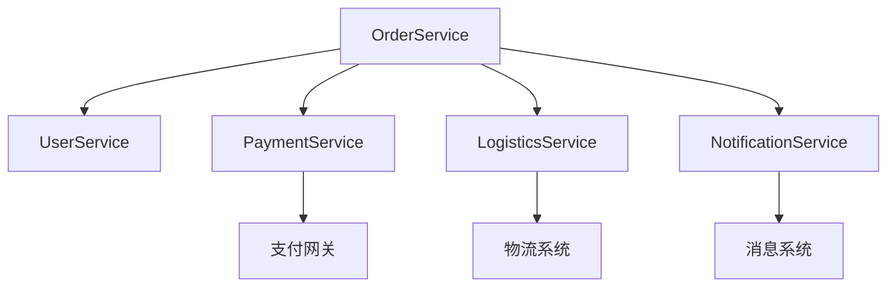
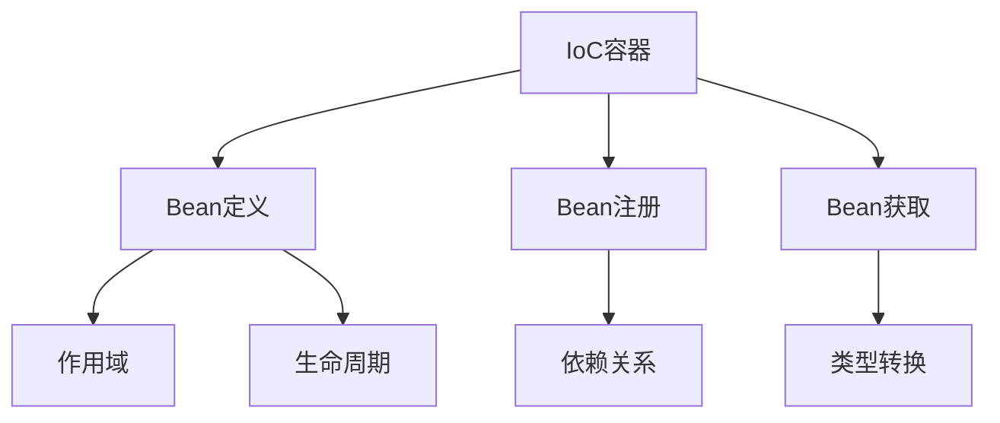
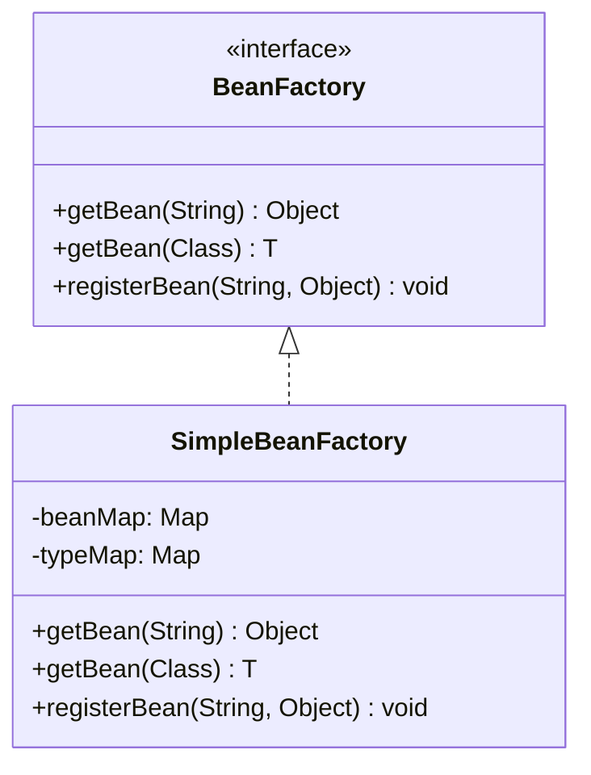
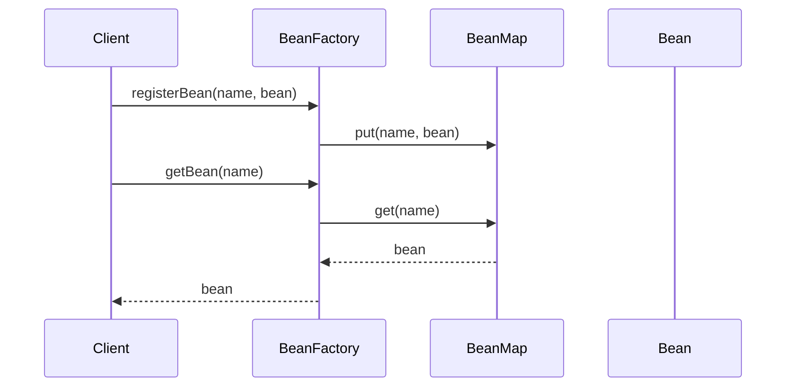

# 第1章：为什么需要IoC容器？

## 导读

### 你将学到什么
- IoC容器解决的核心问题和应用场景
- IoC和DI的设计思想与实现原理
- 手写一个基础的IoC容器
- Spring IoC容器的设计精髓

### 预备知识
- Java基础：反射、集合、并发
- 设计模式：工厂模式、单例模式
- 设计原则：依赖倒置、单一职责
- Maven项目构建基础

### 重点概念
- 控制反转（IoC）
- 依赖注入（DI）
- Bean生命周期
- 容器设计

## 1. 问题引入：对象创建的困境

### 1.1 实际问题场景
小明正在开发一个电商系统的订单模块，需要实现订单创建功能：

```java
public class OrderService {
    // 直接在代码中创建依赖对象
    private UserService userService = new UserService();
    private PaymentService paymentService = new PaymentService();
    private LogisticsService logisticsService = new LogisticsService();
    private NotificationService notificationService = new EmailNotificationService();
    
    public Order createOrder(String userId, List<Product> products) {
        // 1. 检查用户信息
        User user = userService.getUser(userId);
        if (!userService.checkUserStatus(user)) {
            throw new IllegalStateException("User is not valid");
        }
        
        // 2. 创建订单
        Order order = new Order(user, products);
        
        // 3. 处理支付
        try {
            paymentService.process(order);
        } catch (PaymentException e) {
            throw new OrderException("Payment failed", e);
        }
        
        // 4. 安排物流
        try {
            logisticsService.arrange(order);
        } catch (LogisticsException e) {
            // 需要回滚支付
            paymentService.refund(order);
            throw new OrderException("Logistics arrangement failed", e);
        }
        
        // 5. 发送通知
        try {
            notificationService.sendOrderConfirmation(order);
        } catch (NotificationException e) {
            // 通知失败不影响订单创建，但需要记录日志
            log.warn("Failed to send notification for order: " + order.getId(), e);
        }
        
        return order;
    }
}
```

### 1.2 问题分析

#### 1.2.1 系统架构图


#### 1.2.2 对象创建和管理的问题
```java
// 问题1：组件直接依赖具体实现
private PaymentService paymentService = new PaymentService();

// 问题2：无法切换实现
// 如果要支持多种支付方式：
private PaymentService paymentService = new AlipayService();  // 改代码
private PaymentService paymentService = new WechatPayService(); // 改代码

// 问题3：无法统一配置
private static final int PAYMENT_TIMEOUT = 30;  // 硬编码
private static final String NOTIFY_TEMPLATE = "order_success"; // 硬编码
```

#### 1.2.3 测试的问题
```java
// 问题4：无法进行单元测试
@Test
public void testCreateOrder() {
    OrderService orderService = new OrderService();
    // 无法注入mock对象
    // 无法模拟各种异常场景
    // 测试会真实调用外部服务
}
```

#### 1.2.4 扩展的问题
```java
// 问题5：扩展功能需要修改代码
public class OrderService {
    // 增加新功能就要添加新的依赖
    private InventoryService inventoryService = new InventoryService();
    private PromotionService promotionService = new PromotionService();
    // 违反开闭原则
}
```

## 2. 解决方案：IoC容器

### 2.1 设计思路


### 2.2 核心接口设计


### 2.3 改进后的代码

#### 2.3.1 定义接口
```java
public interface PaymentService {
    void process(Order order) throws PaymentException;
    void refund(Order order) throws PaymentException;
}

public interface LogisticsService {
    void arrange(Order order) throws LogisticsException;
    DeliveryInfo getDeliveryInfo(String orderId);
}

public interface NotificationService {
    void sendOrderConfirmation(Order order) throws NotificationException;
    boolean isNotificationSent(String orderId);
}
```

#### 2.3.2 使用依赖注入
```java
public class OrderService {
    private final UserService userService;
    private final PaymentService paymentService;
    private final LogisticsService logisticsService;
    private final NotificationService notificationService;
    
    // 通过构造函数注入依赖
    public OrderService(
            UserService userService,
            PaymentService paymentService,
            LogisticsService logisticsService,
            NotificationService notificationService) {
        this.userService = Objects.requireNonNull(userService, "UserService must not be null");
        this.paymentService = Objects.requireNonNull(paymentService, "PaymentService must not be null");
        this.logisticsService = Objects.requireNonNull(logisticsService, "LogisticsService must not be null");
        this.notificationService = Objects.requireNonNull(notificationService, "NotificationService must not be null");
    }
    
    public Order createOrder(String userId, List<Product> products) {
        // 业务逻辑不变，但现在更容易测试和扩展
        User user = userService.getUser(userId);
        if (!userService.checkUserStatus(user)) {
            throw new IllegalStateException("User is not valid");
        }
        
        Order order = new Order(user, products);
        
        try {
            paymentService.process(order);
        } catch (PaymentException e) {
            throw new OrderException("Payment failed", e);
        }
        
        try {
            logisticsService.arrange(order);
        } catch (LogisticsException e) {
            paymentService.refund(order);
            throw new OrderException("Logistics arrangement failed", e);
        }
        
        try {
            notificationService.sendOrderConfirmation(order);
        } catch (NotificationException e) {
            log.warn("Failed to send notification for order: " + order.getId(), e);
        }
        
        return order;
    }
}
```

### 2.4 Bean创建时序图


## 3. 与Spring的对比分析

### 3.1 IoC容器对比
| 特性 | Mini-Spring | Spring Framework |
|------|-------------|------------------|
| 容器类型 | 简单Map存储 | 层次性容器 |
| Bean定义 | 直接注册对象 | BeanDefinition |
| 作用域 | 单例 | 支持多种作用域 |
| 生命周期 | 简单创建销毁 | 完整生命周期 |
| 扩展点 | 无 | 丰富的扩展机制 |

### 3.2 核心实现对比
```java
// Mini-Spring的实现
public class SimpleBeanFactory implements BeanFactory {
    private final Map<String, Object> beanMap = new ConcurrentHashMap<>();
    
    @Override
    public Object getBean(String name) {
        return beanMap.get(name);
    }
}

// Spring的实现
public class DefaultListableBeanFactory extends AbstractAutowireCapableBeanFactory
        implements ConfigurableListableBeanFactory, BeanDefinitionRegistry {
    
    private final Map<String, BeanDefinition> beanDefinitionMap = new ConcurrentHashMap<>(256);
    
    @Override
    public Object getBean(String name) throws BeansException {
        return doGetBean(name, null, null, false);
    }
}
```

## 4. 面试题精讲

### 4.1 基础概念
1. **什么是IoC？**
   - 控制反转，是一种设计原则
   - 将对象的创建和管理交给容器
   - 通过依赖注入实现解耦

2. **IoC能解决什么问题？**
   - 降低组件间耦合度
   - 提高代码可测试性
   - 统一管理对象生命周期
   - 支持灵活的配置管理

3. **IoC和DI的关系？**
   - IoC是一种设计原则
   - DI是IoC的具体实现方式
   - DI通过构造函数或setter方法注入依赖

### 4.2 实践经验
1. **依赖注入的最佳实践**
   - 优先使用构造函数注入
   - 必要时使用setter注入
   - 避免字段注入
   - 注入接口而非实现类

2. **如何处理可选依赖？**
   - 使用Optional包装
   - 提供默认实现
   - 使用空对象模式

3. **如何处理循环依赖？**
   - 重新设计以避免循环依赖
   - 使用setter注入
   - 使用@Lazy注解

## 5. 实践练习

### 5.1 基础练习：实现简单IoC容器
```java
public interface BeanFactory {
    Object getBean(String name);
    void registerBean(String name, Object bean);
}

// 任务：实现SimpleBeanFactory类
public class SimpleBeanFactory implements BeanFactory {
    // 1. 添加必要的成员变量
    // 2. 实现getBean方法
    // 3. 实现registerBean方法
    // 4. 处理异常情况
}
```

### 5.2 进阶练习：支持类型查找
```java
public interface BeanFactory {
    Object getBean(String name);
    <T> T getBean(Class<T> type);  // 新增
    void registerBean(String name, Object bean);
}

// 任务：增强SimpleBeanFactory
// 1. 添加类型到实例的映射
// 2. 实现按类型查找的功能
// 3. 处理类型转换异常
```

### 5.3 检验
完成练习后，运行以下代码检验实现：
```java
// 1. 创建容器
BeanFactory beanFactory = new SimpleBeanFactory();

// 2. 注册Bean
beanFactory.registerBean("paymentService", new AlipayService());
beanFactory.registerBean("logisticsService", new SFExpressService());

// 3. 获取Bean
PaymentService paymentService = (PaymentService) beanFactory.getBean("paymentService");
LogisticsService logisticsService = beanFactory.getBean(LogisticsService.class);

// 4. 验证功能
assert paymentService != null;
assert logisticsService != null;
assert paymentService instanceof AlipayService;
assert logisticsService instanceof SFExpressService;
```

## 6. 总结与展望

### 6.1 本章重点
1. 理解了IoC的核心价值
2. 掌握了依赖注入的实现方式
3. 学会了如何设计可测试的代码
4. 理解了IoC容器的基本实现

### 6.2 下章预告
下一章我们将探讨：
1. 如何描述和管理Bean的配置信息
2. BeanDefinition的设计与实现
3. Bean的注册与获取机制

``` 
</rewritten_file>