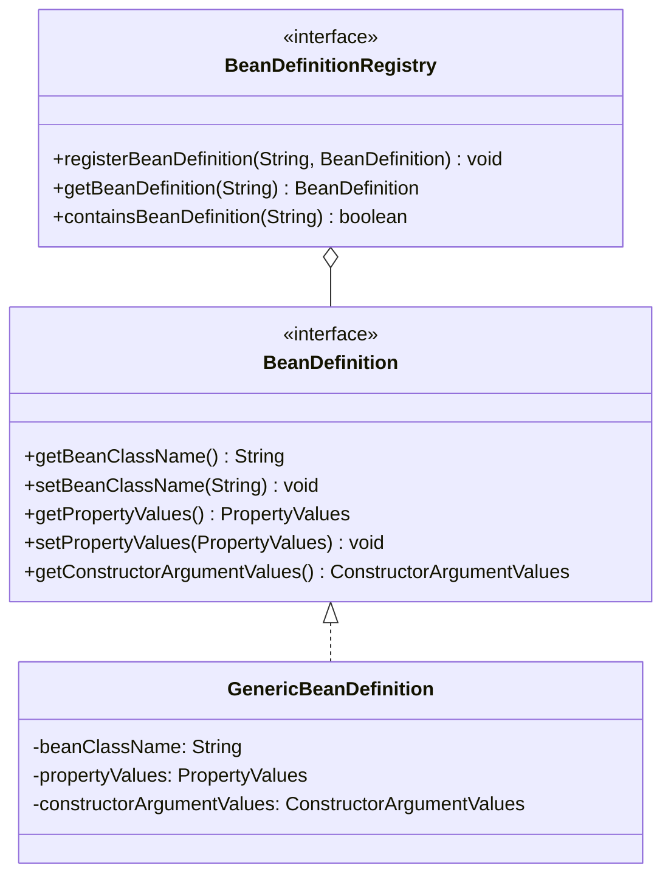
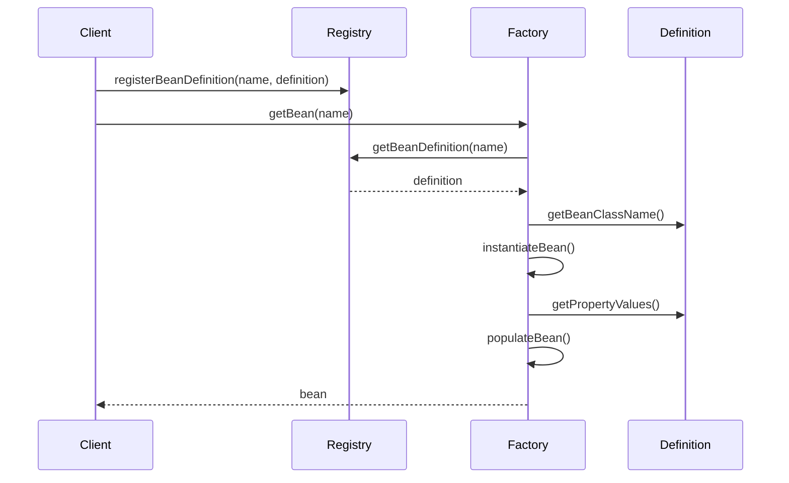

# 第2章：BeanDefinition和Bean的实例化

## 1. 问题引入：配置困境

### 1.1 实际问题场景
在使用了第一章实现的IoC容器后，小明遇到了新的问题。他需要配置一个订单服务：

```java
public class OrderService {
    private int maxRetryCount = 3;  // 最大重试次数
    private String serverUrl;       // 订单服务地址
    private UserDao userDao;        // 用户数据访问
    
    // 构造函数
    public OrderService(UserDao userDao) {
        this.userDao = userDao;
    }
    
    // setter方法
    public void setMaxRetryCount(int maxRetryCount) {
        this.maxRetryCount = maxRetryCount;
    }
    
    public void setServerUrl(String serverUrl) {
        this.serverUrl = serverUrl;
    }
}
```

使用第一章的IoC容器，小明不得不这样注册bean：

```java
// 1. 创建UserDao
UserDao userDao = new UserDao();
beanFactory.registerBean("userDao", userDao);

// 2. 创建OrderService并注入UserDao
OrderService orderService = new OrderService(userDao);
// 3. 设置属性
orderService.setMaxRetryCount(5);
orderService.setServerUrl("http://order.server.com");
beanFactory.registerBean("orderService", orderService);
```

这种方式存在以下问题：
1. 对象创建和属性设置的代码散落在各处
2. 无法集中管理Bean的配置信息
3. 配置信息和代码耦合，修改配置需要改代码
4. 无法支持不同的实例化策略

### 1.2 问题分析

#### 1.2.1 配置信息管理
目前的问题：
```java
// 问题1：配置信息散落在代码中
orderService.setMaxRetryCount(5);
orderService.setServerUrl("http://order.server.com");

// 问题2：修改配置需要重新编译代码
public static final int MAX_RETRY_COUNT = 5;  // 硬编码配置
```

#### 1.2.2 实例化策略
```java
// 问题3：只能通过构造函数创建对象
OrderService orderService = new OrderService(userDao);

// 问题4：无法使用工厂方法或其他方式创建对象
public class OrderServiceFactory {
    public static OrderService createOrderService() {
        // 工厂方法创建对象
        return new OrderService(new UserDao());
    }
}
```

## 2. 解决方案：BeanDefinition

### 2.1 核心思路
1. 将Bean的定义信息和实例化过程分离
2. 通过BeanDefinition描述Bean的配置信息
3. 实现统一的Bean实例化流程
4. 支持多种实例化策略

### 2.2 整体设计

#### 2.2.1 类图


#### 2.2.2 时序图


## 3. 具体实现

### 3.1 BeanDefinition接口
```java
public interface BeanDefinition {
    String getBeanClassName();
    void setBeanClassName(String beanClassName);
    
    PropertyValues getPropertyValues();
    void setPropertyValues(PropertyValues pvs);
    
    ConstructorArgumentValues getConstructorArgumentValues();
    void setConstructorArgumentValues(ConstructorArgumentValues cav);
    
    String getScope();
    void setScope(String scope);
    
    boolean isSingleton();
    boolean isPrototype();
}
```

### 3.2 PropertyValues实现
```java
public class PropertyValue {
    private final String name;
    private final Object value;
    
    public PropertyValue(String name, Object value) {
        this.name = name;
        this.value = value;
    }
    // getters...
}

public class PropertyValues {
    private final List<PropertyValue> propertyValueList = new ArrayList<>();
    
    public void addPropertyValue(PropertyValue pv) {
        propertyValueList.add(pv);
    }
    
    public PropertyValue[] getPropertyValues() {
        return propertyValueList.toArray(new PropertyValue[0]);
    }
}
```

### 3.3 实例化策略
```java
public interface InstantiationStrategy {
    Object instantiate(BeanDefinition bd, String beanName, Constructor<?> ctor, Object[] args);
}

public class SimpleInstantiationStrategy implements InstantiationStrategy {
    @Override
    public Object instantiate(BeanDefinition bd, String beanName, Constructor<?> ctor, Object[] args) {
        Class<?> clazz = bd.getBeanClass();
        try {
            if (ctor == null) {
                return clazz.newInstance();
            }
            return ctor.newInstance(args);
        } catch (Exception e) {
            throw new BeansException("Failed to instantiate [" + clazz.getName() + "]", e);
        }
    }
}
```

## 4. 与Spring的对比分析

### 4.1 我们的实现 vs Spring
1. 我们的实现：
   - 基本的Bean定义功能
   - 简单的属性注入支持
   - 基础的构造函数支持

2. Spring的实现：
   - 更丰富的Bean定义属性
   - 完整的作用域支持
   - 复杂的实例化策略
   - 完善的生命周期管理

### 4.2 Spring中的实例化策略示例
```java
@Configuration
public class AppConfig {
    @Bean
    @Scope("prototype")
    public OrderService orderService(UserDao userDao) {
        OrderService service = new OrderService(userDao);
        service.setMaxRetryCount(5);
        service.setServerUrl("http://order.server.com");
        return service;
    }
}
```

## 5. 面试题解析

### 5.1 核心概念
1. **什么是BeanDefinition？**
   - 定义：Bean的配置信息的抽象
   - 作用：描述Bean的创建和配置方式
   - 好处：实现配置和实例化的解耦

2. **BeanDefinition包含哪些信息？**
   - Bean的类名
   - 作用域信息
   - 构造参数
   - 属性值
   - 生命周期回调方法

3. **为什么需要BeanDefinitionRegistry？**
   - 统一管理Bean定义
   - 支持运行时注册
   - 实现配置的集中管理

## 6. 实践练习

1. 实现一个简单的XML配置文件解析器，支持以下配置：
```xml
<bean id="orderService" class="com.example.OrderService">
    <constructor-arg ref="userDao"/>
    <property name="maxRetryCount" value="5"/>
    <property name="serverUrl" value="http://order.server.com"/>
</bean>
```

## 7. 总结与展望

### 7.1 本章小结
1. 理解了BeanDefinition的意义和作用
2. 实现了Bean定义和实例化的解耦
3. 支持了灵活的Bean配置方式

### 7.2 下一章预告
在第3章中，我们将：
1. 实现Bean的生命周期管理
2. 添加初始化和销毁方法支持
3. 实现Aware接口

这些特性将使我们的IoC容器更加完善，为后续AOP的实现打下基础。 