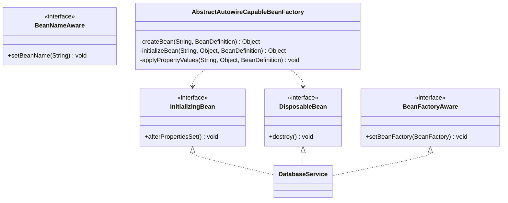
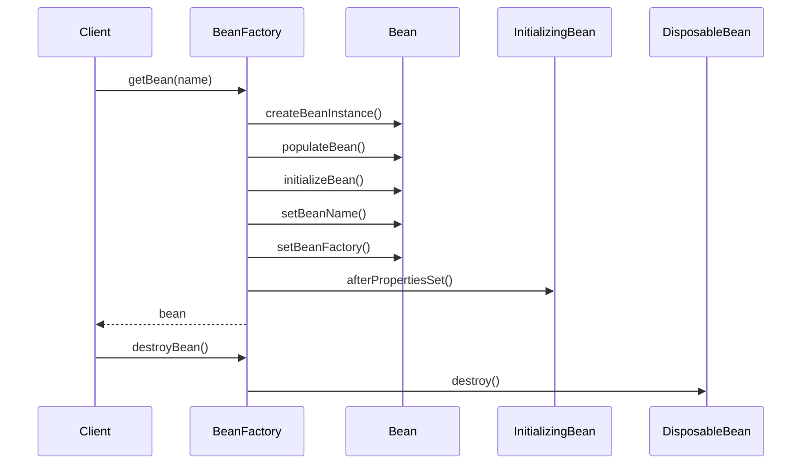

# 第3章：Bean的生命周期管理

## 1. 问题引入：对象生命周期管理的困境

### 1.1 实际问题场景
小明在使用了第二章的BeanDefinition后，遇到了新的问题。他正在开发一个数据库连接服务：

```java
public class DatabaseService {
    private String url;
    private String username;
    private String password;
    private Connection connection;
    
    public void setUrl(String url) {
        this.url = url;
    }
    
    public void setUsername(String username) {
        this.username = username;
    }
    
    public void setPassword(String password) {
        this.password = password;
    }
    
    // 需要在所有属性设置完成后才能初始化连接
    public void connect() {
        try {
            connection = DriverManager.getConnection(url, username, password);
            System.out.println("数据库连接成功");
        } catch (SQLException e) {
            throw new RuntimeException("连接数据库失败", e);
        }
    }
    
    // 在服务关闭时需要释放连接
    public void disconnect() {
        if (connection != null) {
            try {
                connection.close();
                System.out.println("数据库连接已关闭");
            } catch (SQLException e) {
                throw new RuntimeException("关闭数据库连接失败", e);
            }
        }
    }
}
```

小明这样使用这个服务：

```java
// 1. 创建BeanDefinition
BeanDefinition definition = new GenericBeanDefinition();
definition.setBeanClassName("com.example.DatabaseService");
PropertyValues propertyValues = new PropertyValues();
propertyValues.addPropertyValue(new PropertyValue("url", "jdbc:mysql://localhost:3306/test"));
propertyValues.addPropertyValue(new PropertyValue("username", "root"));
propertyValues.addPropertyValue(new PropertyValue("password", "123456"));
definition.setPropertyValues(propertyValues);

// 2. 注册BeanDefinition
beanFactory.registerBeanDefinition("dataService", definition);

// 3. 获取Bean
DatabaseService service = (DatabaseService) beanFactory.getBean("dataService");
// 4. 手动调用初始化方法
service.connect();

// 5. 使用Bean
service.executeQuery("SELECT * FROM users");

// 6. 手动调用销毁方法
service.disconnect();
```

这种方式存在以下问题：
1. 需要手动调用初始化和销毁方法
2. 无法感知容器状态（如获取BeanFactory）
3. 初始化和销毁方法的调用时机不确定
4. 无法统一管理Bean的生命周期

### 1.2 问题分析

#### 1.2.1 生命周期管理问题
```java
// 问题1：初始化方法需要手动调用
service.connect();

// 问题2：销毁方法可能被遗忘
service.disconnect();  // 很容易忘记调用

// 问题3：无法在所有属性设置完成后自动调用初始化方法
propertyValues.addPropertyValue(new PropertyValue("url", "jdbc:mysql://localhost:3306/test"));
// 这里应该自动调用connect()方法
```

#### 1.2.2 容器感知问题
```java
public class UserService {
    // 问题4：无法获取容器中的其他Bean
    private BeanFactory beanFactory;  // 如何注入？
    
    // 问题5：无法感知自己的名字
    private String beanName;  // 如何获取？
}
```

## 2. 解决方案：Bean的生命周期管理

### 2.1 核心思路
1. 定义Bean的生命周期回调接口
2. 实现Bean的初始化和销毁方法
3. 提供容器感知能力
4. 统一管理生命周期流程

### 2.2 整体设计

#### 2.2.1 类图


#### 2.2.2 时序图


## 3. 具体实现

### 3.1 生命周期接口
```java
public interface InitializingBean {
    void afterPropertiesSet() throws Exception;
}

public interface DisposableBean {
    void destroy() throws Exception;
}

public interface BeanFactoryAware {
    void setBeanFactory(BeanFactory beanFactory) throws BeansException;
}

public interface BeanNameAware {
    void setBeanName(String name);
}
```

### 3.2 Bean工厂实现
```java
public abstract class AbstractAutowireCapableBeanFactory extends AbstractBeanFactory {
    
    @Override
    protected Object createBean(String beanName, BeanDefinition beanDefinition) throws BeansException {
        Object bean = null;
        try {
            bean = createBeanInstance(beanDefinition);
            applyPropertyValues(beanName, bean, beanDefinition);
            bean = initializeBean(beanName, bean, beanDefinition);
        } catch (Exception e) {
            throw new BeansException("Creation of bean failed", e);
        }
        registerDisposableBeanIfNecessary(beanName, bean, beanDefinition);
        return bean;
    }
    
    protected Object initializeBean(String beanName, Object bean, BeanDefinition beanDefinition) {
        // 1. 处理Aware接口
        if (bean instanceof BeanNameAware) {
            ((BeanNameAware) bean).setBeanName(beanName);
        }
        if (bean instanceof BeanFactoryAware) {
            ((BeanFactoryAware) bean).setBeanFactory(this);
        }
        
        // 2. 初始化方法调用
        try {
            if (bean instanceof InitializingBean) {
                ((InitializingBean) bean).afterPropertiesSet();
            }
        } catch (Exception e) {
            throw new BeansException("Invocation of init method failed", e);
        }
        return bean;
    }
}
```

### 3.3 数据库服务实现
```java
public class DatabaseService implements InitializingBean, DisposableBean, BeanFactoryAware {
    private String url;
    private String username;
    private String password;
    private Connection connection;
    private BeanFactory beanFactory;
    
    @Override
    public void afterPropertiesSet() throws Exception {
        connection = DriverManager.getConnection(url, username, password);
        System.out.println("数据库连接已初始化");
    }
    
    @Override
    public void destroy() throws Exception {
        if (connection != null) {
            connection.close();
            System.out.println("数据库连接已关闭");
        }
    }
    
    @Override
    public void setBeanFactory(BeanFactory beanFactory) throws BeansException {
        this.beanFactory = beanFactory;
    }
    
    // setter方法省略...
}
```

## 4. 与Spring的对比分析

### 4.1 我们的实现 vs Spring
1. 我们的实现：
   - 基本的生命周期回调
   - 简单的Aware接口支持
   - 统一的初始化和销毁流程

2. Spring的实现：
   - 更多的扩展点（如BeanPostProcessor）
   - 更丰富的Aware接口
   - 注解支持（@PostConstruct、@PreDestroy）
   - 更完善的生命周期管理

### 4.2 Spring中的生命周期示例
```java
@Component
public class SpringDatabaseService implements InitializingBean, DisposableBean {
    @Value("${database.url}")
    private String url;
    
    @PostConstruct
    public void init() {
        System.out.println("注解方式的初始化方法");
    }
    
    @PreDestroy
    public void preDestroy() {
        System.out.println("注解方式的销毁方法");
    }
    
    @Override
    public void afterPropertiesSet() throws Exception {
        System.out.println("InitializingBean方式的初始化");
    }
    
    @Override
    public void destroy() throws Exception {
        System.out.println("DisposableBean方式的销毁");
    }
}
```

## 5. 面试题解析

### 5.1 核心概念
1. **Bean的生命周期有哪些阶段？**
   - 实例化：创建Bean实例
   - 属性赋值：设置属性值
   - Aware接口回调：注入容器相关依赖
   - 初始化：执行初始化方法
   - 使用：正常使用Bean
   - 销毁：执行销毁方法

2. **Aware接口的作用是什么？**
   - 让Bean获得容器的功能
   - 获取Bean的名字
   - 获取Bean所在的工厂
   - 实现容器和Bean的解耦

3. **InitializingBean和DisposableBean的作用？**
   - InitializingBean：属性设置完成后的初始化
   - DisposableBean：Bean销毁前的清理工作
   - 统一管理Bean的生命周期回调

## 6. 实践练习

1. 实现一个简单的连接池，要求：
```java
public interface ConnectionPool extends InitializingBean, DisposableBean {
    Connection getConnection();
    void releaseConnection(Connection connection);
}
```

## 7. 总结与展望

### 7.1 本章小结
1. 实现了Bean的生命周期管理
2. 支持了容器感知功能
3. 提供了统一的初始化和销毁机制

### 7.2 下一章预告
在第4章中，我们将：
1. 实现Bean的作用域管理
2. 支持singleton和prototype
3. 处理循环依赖问题

这些特性将使我们的IoC容器更加完善，为后续功能扩展打下基础。 