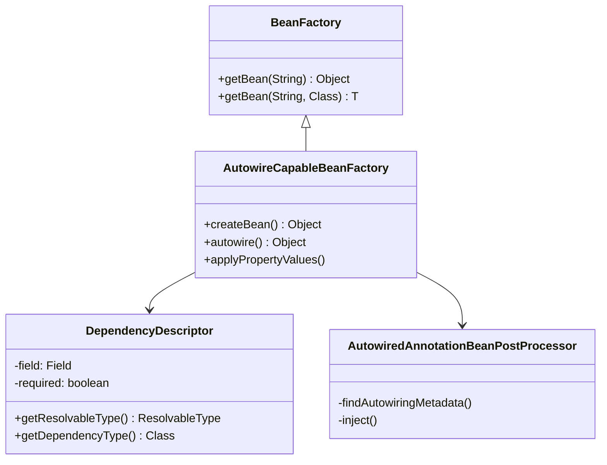
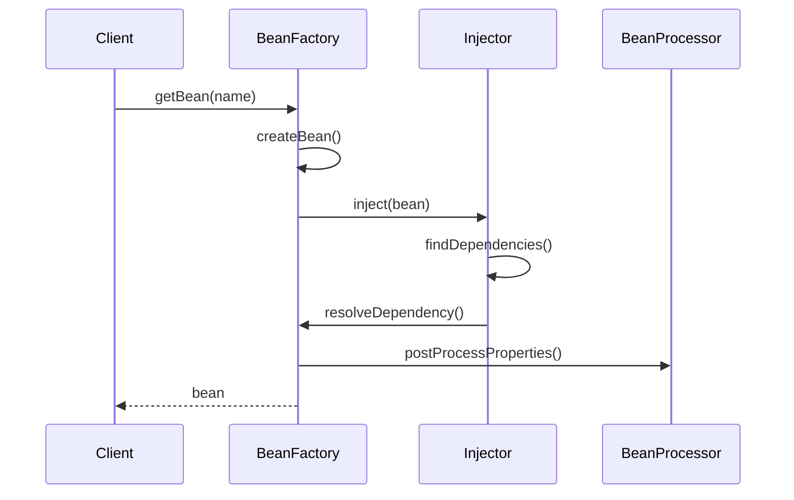

# 第4章：依赖注入的实现

## 1. 问题引入：手动依赖管理的困境

### 1.1 实际问题场景
在使用了第三章的生命周期管理后，小明在开发用户注册功能时遇到了新的问题：

```java
public class UserService {
    // 手动创建依赖对象
    private UserDao userDao = new UserDao();
    private EmailService emailService = new EmailService();
    private SmsService smsService = new SmsService();
    
    public void register(String username, String password) {
        // 1. 检查用户名是否存在
        if (userDao.findByUsername(username) != null) {
            throw new RuntimeException("用户名已存在");
        }
        
        // 2. 创建用户
        User user = new User(username, password);
        userDao.save(user);
        
        // 3. 发送通知
        emailService.sendWelcomeEmail(user.getEmail());
        smsService.sendWelcomeSms(user.getPhone());
    }
}

// 邮件服务需要配置信息
public class EmailService {
    private String smtpHost = "smtp.example.com";  // 应该从配置文件读取
    private int smtpPort = 25;                     // 应该从配置文件读取
    private String username = "admin";             // 应该从配置文件读取
    private String password = "123456";            // 应该从配置文件读取
    
    public void sendWelcomeEmail(String email) {
        // 发送邮件逻辑
    }
}

// 短信服务需要其他服务的支持
public class SmsService {
    private MessageQueue messageQueue = new MessageQueue();  // 应该注入
    private SmsProvider smsProvider = new SmsProvider();     // 应该注入
    
    public void sendWelcomeSms(String phone) {
        // 发送短信逻辑
    }
}
```

这种方式存在以下问题：
1. 组件之间强耦合，难以测试和维护
2. 配置信息硬编码，不易修改
3. 依赖对象的创建时机不可控
4. 无法实现依赖的动态替换

### 1.2 问题分析

#### 1.2.1 依赖创建问题
```java
// 问题1：硬编码依赖创建
private UserDao userDao = new UserDao();  // 强耦合，难以测试

// 问题2：配置信息硬编码
private String smtpHost = "smtp.example.com";  // 不易修改

// 问题3：复杂对象的创建
public class ComplexService {
    // 创建过程复杂，依赖关系混乱
    private ServiceA serviceA = new ServiceA(
        new DependencyB(new DependencyC()),
        new DependencyD()
    );
}
```

#### 1.2.2 依赖注入方式
```java
// 方式1：构造函数注入
public class UserService {
    private final UserDao userDao;
    private final EmailService emailService;
    
    // 参数太多，不易维护
    public UserService(UserDao userDao, EmailService emailService,
                      SmsService smsService, ConfigService configService) {
        this.userDao = userDao;
        this.emailService = emailService;
        // ...更多依赖
    }
}

// 方式2：setter注入
public class UserService {
    private UserDao userDao;
    private EmailService emailService;
    
    // 调用顺序不确定，可能漏掉
    public void setUserDao(UserDao userDao) {
        this.userDao = userDao;
    }
    
    public void setEmailService(EmailService emailService) {
        this.emailService = emailService;
    }
}
```

## 2. 解决方案：依赖注入系统

### 2.1 核心思路
1. 设计依赖注入的抽象
2. 实现构造函数和setter注入
3. 支持不同类型的依赖装配
4. 处理循环依赖问题

### 2.2 整体设计

#### 2.2.1 类图


#### 2.2.2 时序图


## 3. 具体实现

### 3.1 依赖描述器
```java
public class DependencyDescriptor {
    private final Field field;            // 字段依赖
    private final Constructor constructor; // 构造函数依赖
    private final Method method;          // 方法依赖
    private final boolean required;       // 是否必须
    private final Class<?> declaringClass;// 声明依赖的类
    
    public Class<?> getDependencyType() {
        if (field != null) {
            return field.getType();
        }
        if (method != null) {
            return method.getParameterTypes()[0];
        }
        return constructor.getParameterTypes()[0];
    }
}
```

### 3.2 依赖注入器
```java
public class AutowiredAnnotationBeanPostProcessor implements BeanPostProcessor {
    private final AutowiredFieldElement[] cachedFieldElements;
    
    @Override
    public PropertyValues postProcessProperties(PropertyValues pvs, Object bean, String beanName) {
        InjectionMetadata metadata = findAutowiringMetadata(beanName, bean.getClass());
        try {
            metadata.inject(bean, beanName, pvs);
        } catch (Exception ex) {
            throw new BeanCreationException(beanName, "Injection of autowired dependencies failed", ex);
        }
        return pvs;
    }
    
    private InjectionMetadata findAutowiringMetadata(String beanName, Class<?> clazz) {
        // 查找@Autowired注解的字段和方法
        List<InjectionElement> elements = new ArrayList<>();
        for (Field field : clazz.getDeclaredFields()) {
            if (field.isAnnotationPresent(Autowired.class)) {
                elements.add(new AutowiredFieldElement(field));
            }
        }
        return new InjectionMetadata(clazz, elements);
    }
}
```

### 3.3 依赖解析器
```java
public class DependencyResolver {
    private final BeanFactory beanFactory;
    
    public Object resolveDependency(DependencyDescriptor descriptor, String beanName) {
        Class<?> type = descriptor.getDependencyType();
        
        // 1. 按类型查找
        Object bean = beanFactory.getBean(type);
        if (bean != null) {
            return bean;
        }
        
        // 2. 按名称查找
        bean = beanFactory.getBean(beanName);
        if (bean != null && type.isInstance(bean)) {
            return bean;
        }
        
        // 3. 如果是必需的依赖，抛出异常
        if (descriptor.isRequired()) {
            throw new NoSuchBeanDefinitionException(type);
        }
        
        return null;
    }
}
```

## 4. 与Spring的对比分析

### 4.1 我们的实现 vs Spring
1. 我们的实现：
   - 基本的构造函数和setter注入
   - 简单的依赖解析机制
   - 基础的循环依赖处理

2. Spring的实现：
   - 更多的注入方式（方法注入、字段注入）
   - 复杂的依赖解析（泛型、数组、集合）
   - 完整的循环依赖解决方案
   - 注解驱动的自动装配

### 4.2 Spring中的依赖注入示例
```java
@Service
public class UserService {
    // 字段注入
    @Autowired
    private UserDao userDao;
    
    // 构造函数注入
    private final EmailService emailService;
    
    @Autowired
    public UserService(EmailService emailService) {
        this.emailService = emailService;
    }
    
    // setter注入
    private SmsService smsService;
    
    @Autowired
    public void setSmsService(SmsService smsService) {
        this.smsService = smsService;
    }
}
```

## 5. 面试题解析

### 5.1 核心概念
1. **Spring提供了哪些依赖注入方式？**
   - 构造函数注入：适用于必需依赖
   - setter注入：适用于可选依赖
   - 字段注入：最简单但不推荐
   - 方法注入：特殊场景使用

2. **构造函数注入和setter注入如何选择？**
   - 构造函数注入：
     * 保证依赖完整性
     * 支持不可变对象
     * 避免循环依赖
   - setter注入：
     * 解决循环依赖
     * 可选依赖
     * 灵活性更高

3. **@Autowired注解的实现原理？**
   - 通过BeanPostProcessor实现
   - 利用反射机制注入
   - 支持类型推断
   - 可以配合@Qualifier使用

## 6. 实践练习

1. 实现一个简单的依赖注入容器：
```java
public interface SimpleContainer {
    // 注册bean定义
    void register(Class<?> beanClass);
    
    // 获取bean实例
    <T> T getBean(Class<T> beanClass);
    
    // 执行依赖注入
    void inject(Object bean);
}
```

2. 支持构造函数注入：
```java
public interface ConstructorResolver {
    // 解析最佳匹配的构造函数
    Constructor<?> resolveConstructor(Class<?> beanClass);
    
    // 解析构造函数参数
    Object[] resolveConstructorArguments(Constructor<?> constructor);
}
```

## 7. 总结与展望

### 7.1 本章小结
1. 理解了依赖注入的核心原理
2. 实现了基本的依赖注入机制
3. 掌握了不同注入方式的应用场景

### 7.2 下一章预告
在第5章中，我们将：
1. 实现资源加载机制
2. 支持配置文件解析
3. 提供统一的资源访问接口

这些特性将使我们的框架能够更灵活地加载和管理外部资源。 