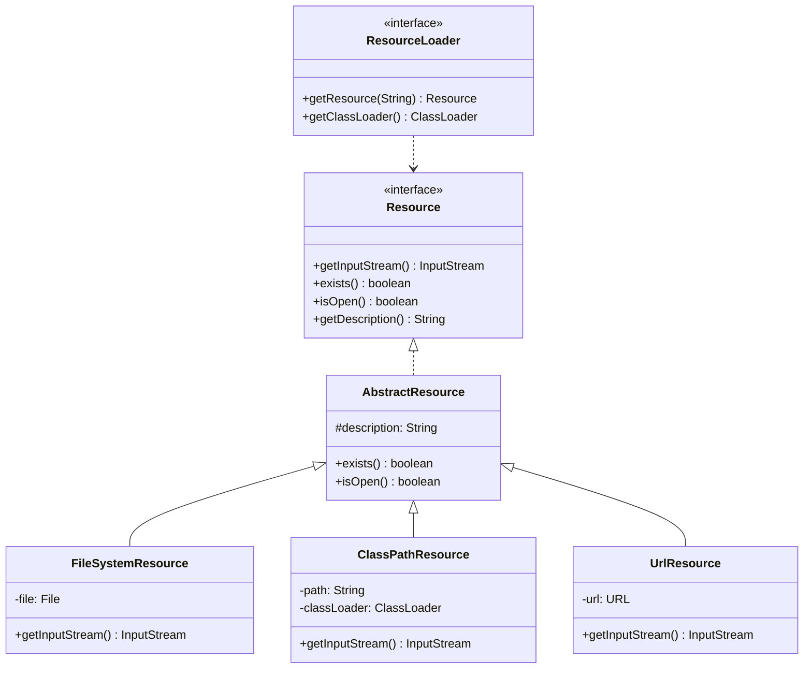
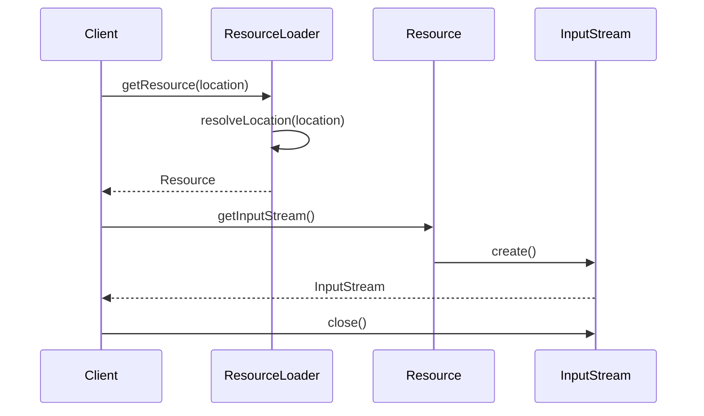

# 第5章：资源加载机制

## 1. 问题引入：配置文件加载的困境

### 1.1 实际问题场景
在使用了第四章的依赖注入后，小明遇到了新的问题。他需要从不同位置加载配置文件：

```java
public class DatabaseConfig {
    private Properties properties = new Properties();
    
    public void loadConfig() {
        try {
            // 问题代码1：直接使用文件路径
            File file = new File("D:/config/database.properties");
            properties.load(new FileInputStream(file));
        } catch (IOException e) {
            throw new RuntimeException("无法加载配置文件", e);
        }
    }
}

public class EmailConfig {
    private Properties properties = new Properties();
    
    public void loadConfig() {
        try {
            // 问题代码2：直接使用类路径
            InputStream is = getClass().getResourceAsStream("/email.properties");
            properties.load(is);
        } catch (IOException e) {
            throw new RuntimeException("无法加载配置文件", e);
        }
    }
}

public class WebConfig {
    private Properties properties = new Properties();
    
    public void loadConfig() {
        try {
            // 问题代码3：直接使用URL
            URL url = new URL("http://config-server/web.properties");
            properties.load(url.openStream());
        } catch (IOException e) {
            throw new RuntimeException("无法加载配置文件", e);
        }
    }
}
```

这种方式存在以下问题：
1. 资源加载方式不统一，难以维护
2. 资源位置硬编码，不易修改
3. 缺乏统一的异常处理
4. 无法实现资源的热更新

### 1.2 问题分析

#### 1.2.1 资源加载问题
```java
// 问题1：不同的加载方式
File file = new File("D:/config/database.properties");
InputStream is = getClass().getResourceAsStream("/email.properties");
URL url = new URL("http://config-server/web.properties");

// 问题2：异常处理分散
try {
    properties.load(new FileInputStream(file));
} catch (IOException e) {
    // 每个地方都需要处理异常
}

// 问题3：资源释放不统一
InputStream is = null;
try {
    is = new FileInputStream(file);
    // 使用输入流
} finally {
    if (is != null) {
        try {
            is.close();
        } catch (IOException e) {
            // 处理关闭异常
        }
    }
}
```

#### 1.2.2 资源抽象问题
```java
// 问题4：缺乏统一的资源表示
String filePath = "D:/config/database.properties";  // 文件系统
String classpathLocation = "classpath:email.properties";  // 类路径
String urlLocation = "http://config-server/web.properties";  // 网络

// 问题5：无法统一处理编码
properties.load(new InputStreamReader(is, "UTF-8"));  // 需要处理编码
```

## 2. 解决方案：统一的资源加载机制

### 2.1 核心思路
1. 设计统一的资源抽象
2. 实现不同的资源加载策略
3. 提供统一的资源加载器
4. 处理资源加载的异常

### 2.2 整体设计

#### 2.2.1 类图


#### 2.2.2 时序图


## 3. 具体实现

### 3.1 资源接口
```java
public interface Resource extends InputStreamSource {
    boolean exists();
    boolean isOpen();
    String getDescription();
    URL getURL() throws IOException;
    File getFile() throws IOException;
    Resource createRelative(String relativePath) throws IOException;
}

public abstract class AbstractResource implements Resource {
    @Override
    public boolean exists() {
        try {
            return getFile().exists();
        } catch (IOException ex) {
            try {
                InputStream is = getInputStream();
                is.close();
                return true;
            } catch (IOException e) {
                return false;
            }
        }
    }
    
    @Override
    public boolean isOpen() {
        return false;
    }
    
    @Override
    public URL getURL() throws IOException {
        throw new FileNotFoundException(getDescription() + " cannot be resolved to URL");
    }
}
```

### 3.2 资源加载器
```java
public interface ResourceLoader {
    String CLASSPATH_URL_PREFIX = "classpath:";
    
    Resource getResource(String location);
    ClassLoader getClassLoader();
}

public class DefaultResourceLoader implements ResourceLoader {
    private ClassLoader classLoader;
    
    @Override
    public Resource getResource(String location) {
        Assert.notNull(location, "Location must not be null");
        
        if (location.startsWith(CLASSPATH_URL_PREFIX)) {
            return new ClassPathResource(location.substring(CLASSPATH_URL_PREFIX.length()), getClassLoader());
        }
        
        try {
            URL url = new URL(location);
            return new UrlResource(url);
        } catch (MalformedURLException ex) {
            return new FileSystemResource(location);
        }
    }
    
    @Override
    public ClassLoader getClassLoader() {
        return (this.classLoader != null ? this.classLoader : ClassUtils.getDefaultClassLoader());
    }
}
```

### 3.3 具体资源实现
```java
public class ClassPathResource extends AbstractResource {
    private final String path;
    private ClassLoader classLoader;
    
    public ClassPathResource(String path, ClassLoader classLoader) {
        this.path = path;
        this.classLoader = classLoader;
    }
    
    @Override
    public InputStream getInputStream() throws IOException {
        InputStream is = classLoader.getResourceAsStream(path);
        if (is == null) {
            throw new FileNotFoundException(path + " cannot be opened because it does not exist");
        }
        return is;
    }
    
    @Override
    public String getDescription() {
        return "class path resource [" + path + "]";
    }
}

public class FileSystemResource extends AbstractResource {
    private final File file;
    
    public FileSystemResource(String path) {
        this.file = new File(path);
    }
    
    @Override
    public InputStream getInputStream() throws IOException {
        return new FileInputStream(file);
    }
    
    @Override
    public String getDescription() {
        return "file [" + file.getAbsolutePath() + "]";
    }
}
```

## 4. 与Spring的对比分析

### 4.1 我们的实现 vs Spring
1. 我们的实现：
   - 基本的资源抽象
   - 简单的资源加载策略
   - 统一的资源访问接口

2. Spring的实现：
   - 更丰富的资源类型（ServletContextResource等）
   - 支持通配符路径解析
   - 提供资源缓存机制
   - 支持协议扩展

### 4.2 Spring中的资源使用示例
```java
@Configuration
public class AppConfig {
    @Value("classpath:database.properties")
    private Resource dbConfig;
    
    @Value("file:/config/app.properties")
    private Resource appConfig;
    
    @Value("http://config-server/web.properties")
    private Resource webConfig;
    
    @Bean
    public DataSource dataSource() throws IOException {
        Properties props = new Properties();
        props.load(dbConfig.getInputStream());
        return new BasicDataSource(props);
    }
}
```

## 5. 面试题解析

### 5.1 核心概念
1. **Spring的资源加载机制是什么？**
   - Resource接口抽象
   - 统一的资源定位
   - 多种资源类型支持
   - 资源加载策略

2. **Resource和ResourceLoader的作用是什么？**
   - Resource：统一的资源抽象
   - ResourceLoader：统一的资源加载
   - 支持不同类型资源
   - 提供统一的访问方式

3. **如何实现自定义的Resource？**
   - 继承AbstractResource
   - 实现必要的方法
   - 提供资源访问逻辑
   - 处理异常情况

## 6. 实践练习

1. 实现一个支持热更新的资源：
```java
public interface RefreshableResource extends Resource {
    // 检查资源是否已更新
    boolean isModified();
    
    // 重新加载资源
    void refresh() throws IOException;
}
```

2. 实现一个复合资源加载器：
```java
public interface CompositeResourceLoader extends ResourceLoader {
    // 添加资源加载器
    void addResourceLoader(ResourceLoader loader);
    
    // 移除资源加载器
    void removeResourceLoader(ResourceLoader loader);
}
```

## 7. 总结与展望

### 7.1 本章小结
1. 实现了统一的资源抽象
2. 提供了不同的资源加载策略
3. 统一了资源访问接口

### 7.2 下一章预告
在第6章中，我们将：
1. 实现应用上下文
2. 提供更高层的抽象
3. 支持统一的Bean生命周期管理

这些特性将为我们的框架提供更完整的应用程序上下文支持。 