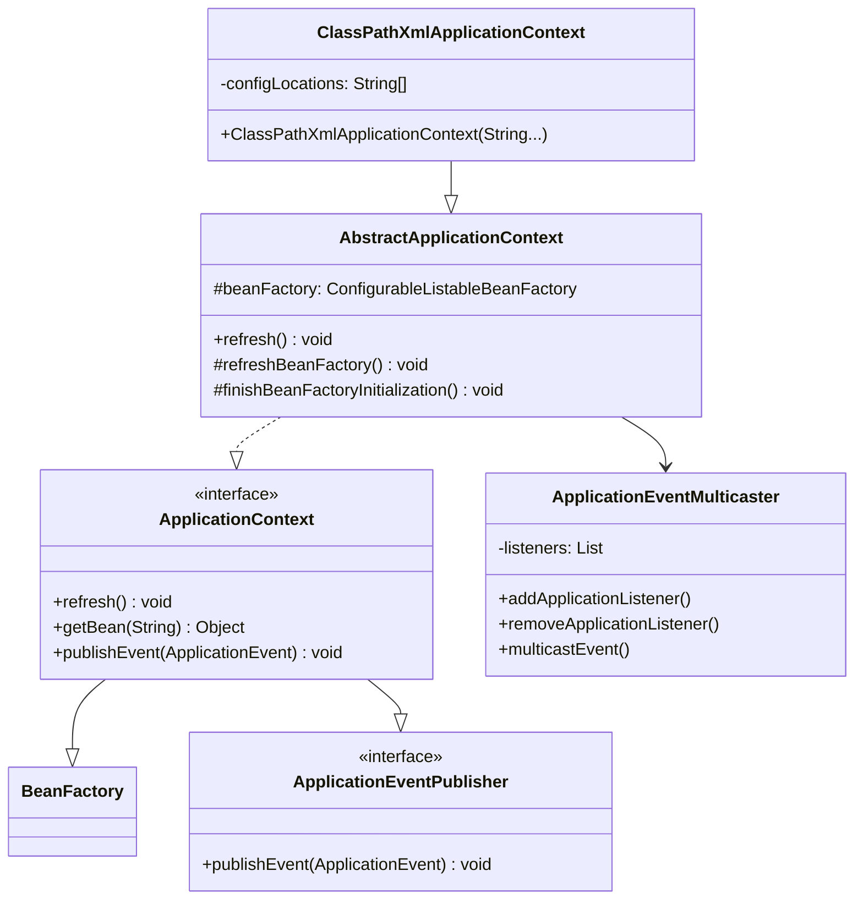
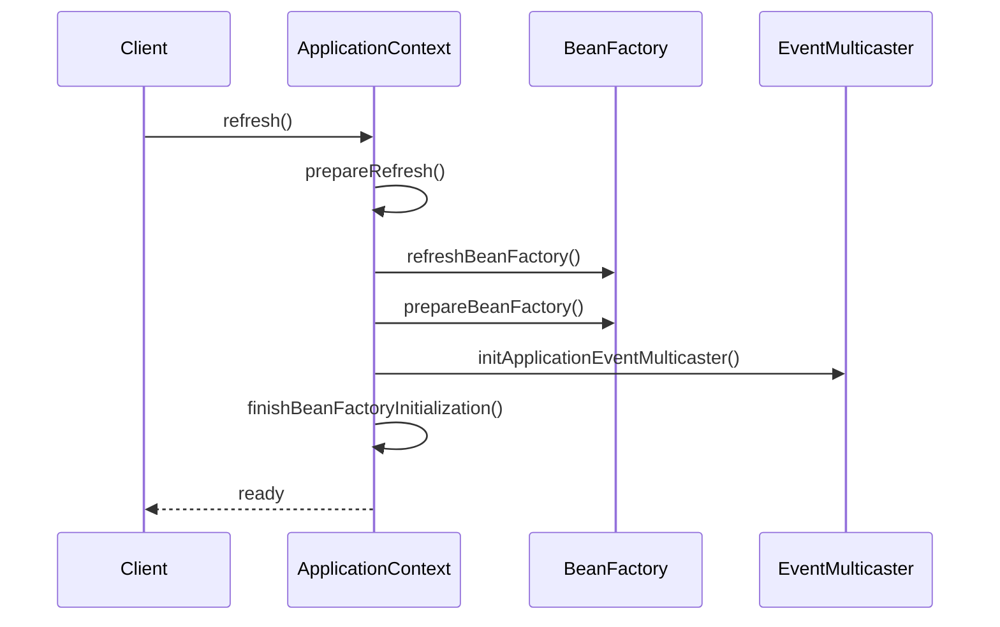

# 第6章：应用上下文

## 1. 问题引入：IoC容器使用的困境

### 1.1 实际问题场景
在使用了第五章的资源加载机制后，小明发现使用IoC容器还是很麻烦：

```java
public class Application {
    public static void main(String[] args) {
        // 问题代码1：需要手动创建和组装多个组件
        DefaultResourceLoader resourceLoader = new DefaultResourceLoader();
        Resource resource = resourceLoader.getResource("classpath:application.xml");
        
        DefaultListableBeanFactory beanFactory = new DefaultListableBeanFactory();
        XmlBeanDefinitionReader reader = new XmlBeanDefinitionReader(beanFactory);
        reader.loadBeanDefinitions(resource);
        
        // 问题代码2：需要手动注册后置处理器
        beanFactory.addBeanPostProcessor(new AutowiredAnnotationBeanPostProcessor());
        
        // 问题代码3：需要手动处理事件监听
        UserService userService = beanFactory.getBean("userService", UserService.class);
        userService.register(new User("张三"));  // 注册成功后应该发送邮件，但是忘记了注册监听器
    }
}

// 问题代码4：配置分散在各处
@Component
public class UserService {
    @Value("${app.name}")  // 属性值从哪里来？
    private String appName;
    
    @Value("${mail.host}")  // 配置如何管理？
    private String mailHost;
    
    @EventListener  // 事件监听如何实现？
    public void handleUserRegistered(UserRegisteredEvent event) {
        // 处理用户注册事件
    }
}

// 问题代码5：国际化支持缺失
@Controller
public class UserController {
    @Value("${user.welcome}")  // 不同语言如何支持？
    private String welcomeMessage;
    
    public String welcome() {
        return welcomeMessage;  // 应该根据用户的语言返回不同的欢迎语
    }
}
```

这种方式存在以下问题：
1. 组件创建和组装过程繁琐
2. 配置管理不统一
3. 缺乏事件机制
4. 没有国际化支持
5. 功能扩展不方便

### 1.2 问题分析

#### 1.2.1 容器使用问题
```java
// 问题1：组件装配繁琐
DefaultListableBeanFactory beanFactory = new DefaultListableBeanFactory();
XmlBeanDefinitionReader reader = new XmlBeanDefinitionReader(beanFactory);
reader.loadBeanDefinitions(resource);
beanFactory.addBeanPostProcessor(new AutowiredAnnotationBeanPostProcessor());

// 问题2：配置加载分散
@Value("${app.name}")  // 配置来源不明确
private String appName;

// 问题3：事件处理不统一
public void register(User user) {
    // 注册用户
    // 发送事件？如何发送？谁来监听？
}
```

#### 1.2.2 功能扩展问题
```java
// 问题4：国际化支持
public class MessageService {
    public String getMessage(String code) {
        // 如何根据不同的语言环境返回不同的消息？
        return code;
    }
}

// 问题5：生命周期管理
@Component
public class ScheduledTask {
    @PostConstruct  // 如何支持注解？
    public void init() {
        // 初始化定时任务
    }
    
    @PreDestroy  // 如何支持注解？
    public void destroy() {
        // 销毁定时任务
    }
}
```

## 2. 解决方案：应用上下文

### 2.1 核心思路
1. 提供统一的应用上下文
2. 实现配置管理机制
3. 支持事件发布订阅
4. 提供国际化支持

### 2.2 整体设计

#### 2.2.1 类图


#### 2.2.2 时序图


## 3. 具体实现

### 3.1 应用上下文抽象
```java
public interface ApplicationContext extends ListableBeanFactory, 
        ResourceLoader, ApplicationEventPublisher {
    String getId();
    String getApplicationName();
    String getDisplayName();
    long getStartupDate();
    ApplicationContext getParent();
    AutowireCapableBeanFactory getAutowireCapableBeanFactory();
}

public abstract class AbstractApplicationContext extends DefaultResourceLoader
        implements ConfigurableApplicationContext {
    
    @Override
    public void refresh() throws BeansException {
        synchronized (this.startupShutdownMonitor) {
            // 1. 准备刷新上下文环境
            prepareRefresh();
            
            // 2. 初始化BeanFactory并进行XML文件读取
            ConfigurableListableBeanFactory beanFactory = obtainFreshBeanFactory();
            
            // 3. 对BeanFactory进行各种功能填充
            prepareBeanFactory(beanFactory);
            
            // 4. 初始化事件多播器
            initApplicationEventMulticaster();
            
            // 5. 注册事件监听器
            registerListeners();
            
            // 6. 初始化所有剩下的单例Bean
            finishBeanFactoryInitialization(beanFactory);
            
            // 7. 完成刷新过程，发布刷新事件
            finishRefresh();
        }
    }
}
```

### 3.2 事件机制实现
```java
public interface ApplicationEventPublisher {
    void publishEvent(ApplicationEvent event);
    void publishEvent(Object event);
}

public class SimpleApplicationEventMulticaster implements ApplicationEventMulticaster {
    private final ListenerRetriever defaultRetriever = new ListenerRetriever();
    
    @Override
    public void multicastEvent(ApplicationEvent event) {
        for (ApplicationListener<?> listener : getApplicationListeners(event)) {
            invokeListener(listener, event);
        }
    }
    
    protected void invokeListener(ApplicationListener<?> listener, ApplicationEvent event) {
        ErrorHandler errorHandler = getErrorHandler();
        if (errorHandler != null) {
            try {
                doInvokeListener(listener, event);
            } catch (Throwable err) {
                errorHandler.handleError(err);
            }
        } else {
            doInvokeListener(listener, event);
        }
    }
}
```

### 3.3 国际化支持
```java
public interface MessageSource {
    String getMessage(String code, Object[] args, String defaultMessage, Locale locale);
    String getMessage(String code, Object[] args, Locale locale) throws NoSuchMessageException;
    String getMessage(MessageSourceResolvable resolvable, Locale locale) throws NoSuchMessageException;
}

public class ResourceBundleMessageSource implements MessageSource {
    private final Map<String, ResourceBundle> bundleCache = new ConcurrentHashMap<>();
    private String basename;
    
    @Override
    public String getMessage(String code, Object[] args, Locale locale) {
        ResourceBundle bundle = getResourceBundle(locale);
        String message = bundle.getString(code);
        return MessageFormat.format(message, args);
    }
    
    protected ResourceBundle getResourceBundle(Locale locale) {
        String key = basename + '_' + locale;
        ResourceBundle bundle = bundleCache.get(key);
        if (bundle == null) {
            bundle = ResourceBundle.getBundle(basename, locale);
            bundleCache.put(key, bundle);
        }
        return bundle;
    }
}
```

## 4. 与Spring的对比分析

### 4.1 我们的实现 vs Spring
1. 我们的实现：
   - 基本的应用上下文功能
   - 简单的事件机制
   - 基础的国际化支持

2. Spring的实现：
   - 更丰富的上下文类型
   - 完整的生命周期管理
   - 强大的扩展机制
   - 复杂的事件处理

### 4.2 Spring中的应用上下文示例
```java
@Configuration
@ComponentScan("com.example")
public class AppConfig {
    @Bean
    public MessageSource messageSource() {
        ResourceBundleMessageSource messageSource = new ResourceBundleMessageSource();
        messageSource.setBasename("messages");
        messageSource.setDefaultEncoding("UTF-8");
        return messageSource;
    }
    
    @EventListener
    public void handleUserRegistered(UserRegisteredEvent event) {
        System.out.println("用户注册成功：" + event.getUser().getUsername());
    }
}

// 使用应用上下文
public class Application {
    public static void main(String[] args) {
        AnnotationConfigApplicationContext context = 
            new AnnotationConfigApplicationContext(AppConfig.class);
        
        UserService userService = context.getBean(UserService.class);
        userService.register(new User("张三"));
        
        String message = context.getMessage("welcome", null, Locale.CHINA);
        System.out.println(message);
    }
}
```

## 5. 面试题解析

### 5.1 核心概念
1. **ApplicationContext和BeanFactory的区别是什么？**
   - ApplicationContext是BeanFactory的超集
   - 提供更多企业级功能
   - 支持事件发布
   - 支持国际化
   - 统一的资源加载

2. **Spring的事件机制是如何实现的？**
   - 基于观察者模式
   - 事件发布者和监听器解耦
   - 支持异步事件处理
   - 提供事件过滤机制

3. **Spring的国际化是如何实现的？**
   - 基于ResourceBundle
   - 支持消息格式化
   - 支持区域解析
   - 支持默认消息

## 6. 实践练习

1. 实现一个简单的应用上下文：
```java
public interface SimpleApplicationContext {
    // 初始化上下文
    void refresh();
    
    // 获取Bean
    <T> T getBean(String name, Class<T> type);
    
    // 发布事件
    void publishEvent(ApplicationEvent event);
    
    // 获取国际化消息
    String getMessage(String code, Locale locale);
}
```

2. 实现一个自定义的事件和监听器：
```java
public class OrderCreatedEvent extends ApplicationEvent {
    private final Order order;
    
    public OrderCreatedEvent(Order order) {
        super(order);
        this.order = order;
    }
}

@Component
public class OrderEventListener implements ApplicationListener<OrderCreatedEvent> {
    @Override
    public void onApplicationEvent(OrderCreatedEvent event) {
        // 处理订单创建事件
    }
}
```

## 7. 总结与展望

### 7.1 本章小结
1. 实现了统一的应用上下文
2. 提供了事件发布订阅机制
3. 支持了国际化功能

### 7.2 下一章预告
在第7章中，我们将：
1. 实现AOP的核心功能
2. 支持不同的代理方式
3. 实现通用的切面机制

这些特性将为我们的框架添加面向切面编程的能力。 