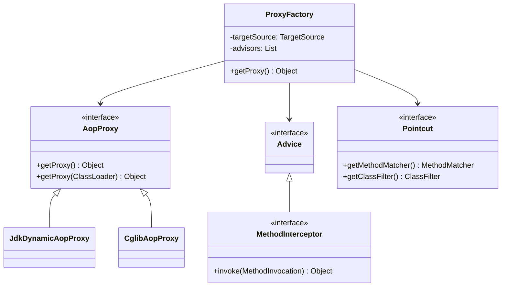
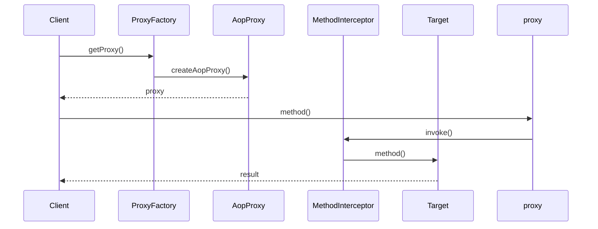

# 第7章：AOP的实现

## 1. 问题引入：横切关注点的困境

### 1.1 实际问题场景
在使用了第六章的应用上下文后，小明在开发订单系统时遇到了新的问题：

```java
@Service
public class OrderService {
    private final OrderRepository orderRepository;
    
    public void createOrder(Order order) {
        // 问题代码1：方法执行时间统计
        long startTime = System.currentTimeMillis();
        try {
            // 问题代码2：事务控制
            TransactionStatus tx = dataSourceTransactionManager.beginTransaction();
            try {
                // 问题代码3：参数校验
                if (order == null || order.getItems().isEmpty()) {
                    throw new IllegalArgumentException("订单信息不完整");
                }
                
                // 核心业务逻辑
                orderRepository.save(order);
                
                // 问题代码4：日志记录
                logger.info("订单创建成功: {}", order.getId());
                
                dataSourceTransactionManager.commit(tx);
            } catch (Exception e) {
                dataSourceTransactionManager.rollback(tx);
                throw e;
            }
        } finally {
            // 问题代码5：性能监控
            long endTime = System.currentTimeMillis();
            logger.info("方法执行时间: {}ms", (endTime - startTime));
        }
    }
    
    public Order getOrder(String orderId) {
        // 同样的横切逻辑在这里重复出现
        long startTime = System.currentTimeMillis();
        try {
            // 参数校验
            if (StringUtils.isEmpty(orderId)) {
                throw new IllegalArgumentException("订单ID不能为空");
            }
            
            // 核心业务逻辑
            Order order = orderRepository.findById(orderId);
            
            // 日志记录
            logger.info("查询订单: {}", orderId);
            
            return order;
        } finally {
            // 性能监控
            long endTime = System.currentTimeMillis();
            logger.info("方法执行时间: {}ms", (endTime - startTime));
        }
    }
}
```

这种方式存在以下问题：
1. 横切关注点代码与业务逻辑混杂
2. 相同的代码在多个方法中重复
3. 代码维护困难，修改一个切面需要修改多处
4. 难以统一管理和配置切面功能
5. 无法动态增减切面功能

### 1.2 问题分析

#### 1.2.1 横切关注点问题
```java
// 问题1：性能监控代码重复
long startTime = System.currentTimeMillis();
try {
    // 业务逻辑
} finally {
    long endTime = System.currentTimeMillis();
    logger.info("执行时间: {}ms", (endTime - startTime));
}

// 问题2：事务控制与业务耦合
TransactionStatus tx = dataSourceTransactionManager.beginTransaction();
try {
    // 业务逻辑
    dataSourceTransactionManager.commit(tx);
} catch (Exception e) {
    dataSourceTransactionManager.rollback(tx);
    throw e;
}

// 问题3：日志记录分散
logger.info("方法开始执行...");
// 业务逻辑
logger.info("方法执行完成...");
```

#### 1.2.2 切面实现问题
```java
// 问题4：无法统一配置切面
@Service
public class ProductService {
    // 每个方法都要重复编写相同的横切逻辑
    public void createProduct(Product product) {
        // 性能监控
        // 事务控制
        // 参数校验
        // 日志记录
    }
}

// 问题5：难以动态调整切面
public class OrderService {
    // 如何动态增加或删除切面？
    public void updateOrder(Order order) {
        // 业务逻辑
    }
}
```

## 2. 解决方案：AOP实现

### 2.1 核心思路
1. 设计代理创建机制
2. 实现通用的切面抽象
3. 支持多种代理方式
4. 提供灵活的切点表达式

### 2.2 整体设计

#### 2.2.1 类图


#### 2.2.2 时序图


## 3. 具体实现

### 3.1 代理工厂
```java
public class ProxyFactory {
    private AdvisedSupport advised;
    
    public Object getProxy() {
        return createAopProxy().getProxy();
    }
    
    protected final synchronized AopProxy createAopProxy() {
        if (this.advised.isProxyTargetClass() || hasNoUserSuppliedProxyInterfaces()) {
            Class<?> targetClass = this.advised.getTargetClass();
            if (targetClass.isInterface() || Proxy.isProxyClass(targetClass)) {
                return new JdkDynamicAopProxy(this.advised);
            }
            return new CglibAopProxy(this.advised);
        }
        return new JdkDynamicAopProxy(this.advised);
    }
}
```

### 3.2 JDK动态代理实现
```java
public class JdkDynamicAopProxy implements AopProxy, InvocationHandler {
    private final AdvisedSupport advised;
    
    public JdkDynamicAopProxy(AdvisedSupport advised) {
        this.advised = advised;
    }
    
    @Override
    public Object getProxy() {
        return Proxy.newProxyInstance(
            ClassUtils.getDefaultClassLoader(),
            this.advised.getTargetClass().getInterfaces(),
            this
        );
    }
    
    @Override
    public Object invoke(Object proxy, Method method, Object[] args) throws Throwable {
        MethodInvocation invocation = new ReflectiveMethodInvocation(
            proxy, this.advised.getTarget(), method, args,
            this.advised.getTargetClass(), this.advised.getInterceptorsAndDynamicInterceptionAdvice(method)
        );
        return invocation.proceed();
    }
}
```

### 3.3 方法拦截器
```java
public interface MethodInterceptor extends Interceptor {
    Object invoke(MethodInvocation invocation) throws Throwable;
}

public class TransactionInterceptor implements MethodInterceptor {
    private final PlatformTransactionManager transactionManager;
    
    @Override
    public Object invoke(MethodInvocation invocation) throws Throwable {
        TransactionStatus status = this.transactionManager.getTransaction(new DefaultTransactionDefinition());
        try {
            Object retVal = invocation.proceed();
            this.transactionManager.commit(status);
            return retVal;
        } catch (Exception ex) {
            this.transactionManager.rollback(status);
            throw ex;
        }
    }
}
```

## 4. 与Spring的对比分析

### 4.1 我们的实现 vs Spring
1. 我们的实现：
   - 基本的代理创建机制
   - 简单的切面实现
   - 主要的拦截器模式

2. Spring的实现：
   - 更丰富的切入点表达式
   - 完整的切面生命周期
   - 复杂的增强组合
   - 注解驱动支持

### 4.2 Spring中的AOP示例
```java
@Aspect
@Component
public class OrderAspect {
    @Around("execution(* com.example.service.OrderService.*(..))")
    public Object handleOrder(ProceedingJoinPoint pjp) throws Throwable {
        long startTime = System.currentTimeMillis();
        try {
            return pjp.proceed();
        } finally {
            long endTime = System.currentTimeMillis();
            System.out.println("方法执行时间：" + (endTime - startTime) + "ms");
        }
    }
    
    @Before("execution(* com.example.service.OrderService.createOrder(..))")
    public void validateOrder(JoinPoint jp) {
        Order order = (Order) jp.getArgs()[0];
        if (order == null || order.getItems().isEmpty()) {
            throw new IllegalArgumentException("订单信息不完整");
        }
    }
}
```

## 5. 面试题解析

### 5.1 核心概念
1. **Spring AOP和AspectJ的区别是什么？**
   - Spring AOP基于代理
   - AspectJ基于字节码增强
   - Spring AOP只支持方法级别
   - AspectJ支持字段级别

2. **Spring如何选择代理方式？**
   - 有接口优先使用JDK动态代理
   - 无接口使用CGLIB代理
   - 可以强制使用CGLIB
   - 考虑性能和功能需求

3. **AOP的实现原理是什么？**
   - 基于动态代理模式
   - 使用拦截器链
   - 织入切面逻辑
   - 管理代理对象

## 6. 实践练习

1. 实现一个简单的性能监控切面：
```java
public interface PerformanceMonitorInterceptor extends MethodInterceptor {
    // 实现方法执行时间统计
    void setLogLevel(int level);
    void setPrefix(String prefix);
}
```

2. 实现一个参数校验切面：
```java
public interface ValidationInterceptor extends MethodInterceptor {
    // 实现方法参数校验
    void addValidator(Class<?> targetClass, String methodName, Validator validator);
}
```

## 7. 总结与展望

### 7.1 本章小结
1. 实现了AOP的核心功能
2. 提供了多种代理方式
3. 支持了切面的织入

### 7.2 下一章预告
在第8章中，我们将：
1. 实现声明式事务
2. 提供事务传播机制
3. 支持事务隔离级别

这些特性将为我们的框架添加事务管理的能力。 