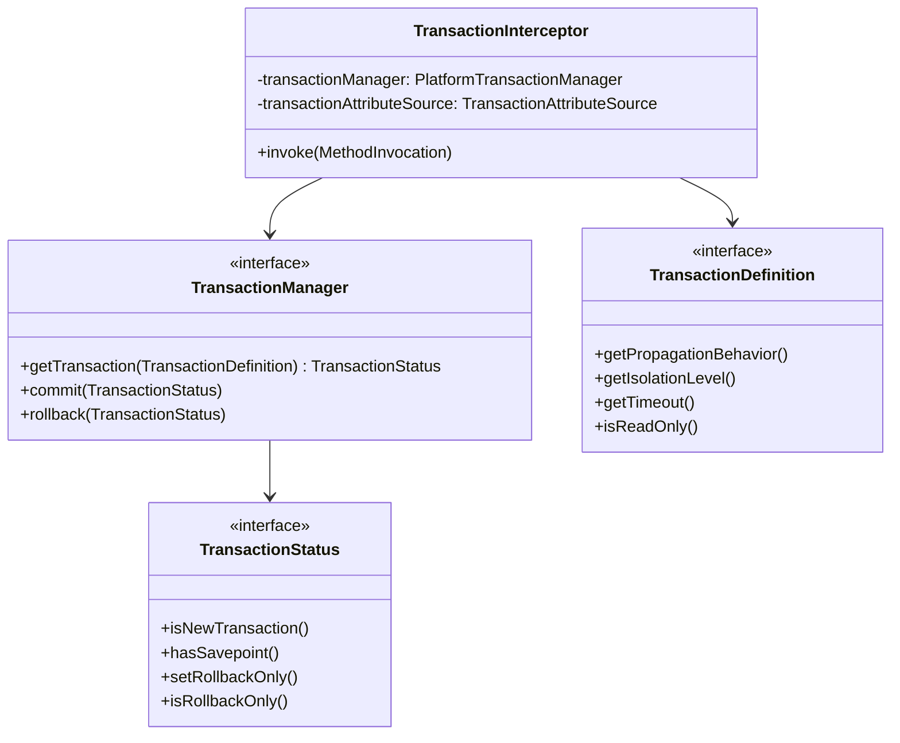
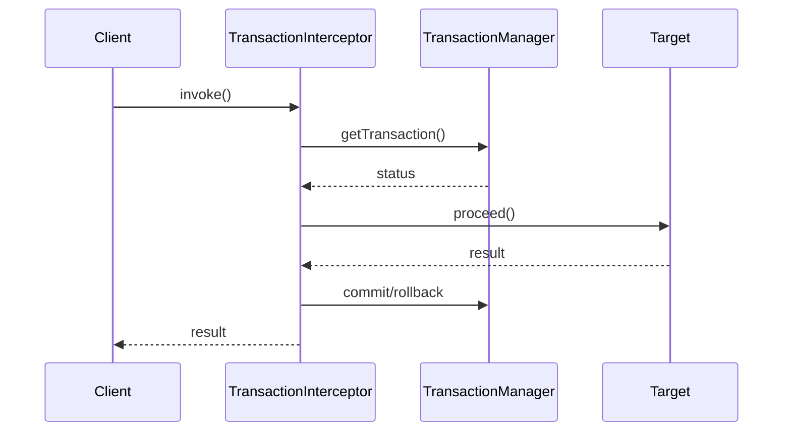

# 第8章：声明式事务的实现

## 1. 问题引入：事务管理的困境

### 1.1 实际问题场景
在使用了第七章的AOP功能后，小明在开发订单支付功能时遇到了新的问题：

```java
@Service
public class PaymentService {
    @Autowired
    private OrderService orderService;
    @Autowired
    private AccountService accountService;
    
    public void processPayment(String orderId, BigDecimal amount) {
        // 问题代码1：手动事务控制
        TransactionStatus tx = null;
        try {
            // 开启事务
            tx = transactionManager.getTransaction(new DefaultTransactionDefinition());
            
            // 问题代码2：多个事务操作
            // 扣减账户余额
            Account account = accountService.getAccount(orderId);
            if (account.getBalance().compareTo(amount) < 0) {
                throw new InsufficientBalanceException("余额不足");
            }
            account.deduct(amount);
            accountService.updateAccount(account);
            
            // 更新订单状态
            Order order = orderService.getOrder(orderId);
            order.setStatus(OrderStatus.PAID);
            order.setPayTime(new Date());
            orderService.updateOrder(order);
            
            // 提交事务
            transactionManager.commit(tx);
        } catch (Exception e) {
            // 问题代码3：事务回滚处理
            if (tx != null) {
                transactionManager.rollback(tx);
            }
            throw new PaymentException("支付失败", e);
        }
    }
    
    // 问题代码4：事务传播行为
    public void refundPayment(String orderId) {
        // 是否需要新建事务？还是加入已有事务？
        Order order = orderService.getOrder(orderId);
        if (order.getStatus() != OrderStatus.PAID) {
            throw new IllegalStateException("订单状态不正确");
        }
        
        // 退款操作
        Account account = accountService.getAccount(orderId);
        account.refund(order.getAmount());
        accountService.updateAccount(account);
        
        // 更新订单状态
        order.setStatus(OrderStatus.REFUNDED);
        orderService.updateOrder(order);
    }
    
    // 问题代码5：事务隔离级别
    public Account getAccountBalance(String accountId) {
        // 如何处理脏读、不可重复读、幻读问题？
        return accountService.getAccount(accountId);
    }
}
```

这种方式存在以下问题：
1. 事务代码与业务逻辑混杂
2. 事务传播行为难以控制
3. 事务隔离级别不易配置
4. 事务回滚规则复杂
5. 代码重复且易出错

### 1.2 问题分析

#### 1.2.1 事务管理问题
```java
// 问题1：事务代码与业务逻辑耦合
TransactionStatus tx = transactionManager.getTransaction(new DefaultTransactionDefinition());
try {
    // 业务逻辑
    transactionManager.commit(tx);
} catch (Exception e) {
    transactionManager.rollback(tx);
    throw e;
}

// 问题2：传播行为控制困难
public void innerMethod() {
    // 是否需要新开事务？
    // 是否要加入外部事务？
    // 外部事务回滚是否影响内部事务？
}

// 问题3：隔离级别设置繁琐
TransactionDefinition def = new DefaultTransactionDefinition();
def.setIsolationLevel(TransactionDefinition.ISOLATION_READ_COMMITTED);
TransactionStatus tx = transactionManager.getTransaction(def);
```

#### 1.2.2 事务实现问题
```java
// 问题4：回滚规则难以统一
try {
    // 业务逻辑
} catch (Exception e) {
    if (e instanceof BusinessException) {
        // 业务异常是否回滚？
        throw e;
    }
    if (e instanceof DataAccessException) {
        // 数据访问异常一定回滚？
        transactionManager.rollback(tx);
    }
}

// 问题5：事务同步困难
public void complexOperation() {
    // 如何保证多个数据源的事务同步？
    mainDB.beginTransaction();
    try {
        logDB.beginTransaction();
        // 业务逻辑
        mainDB.commit();
        logDB.commit();
    } catch (Exception e) {
        mainDB.rollback();
        logDB.rollback();
    }
}
```

## 2. 解决方案：声明式事务

### 2.1 核心思路
1. 使用AOP实现事务代理
2. 定义事务属性和传播行为
3. 实现事务同步管理
4. 处理事务回滚规则

### 2.2 整体设计

#### 2.2.1 类图


#### 2.2.2 时序图


## 3. 具体实现

### 3.1 事务管理器
```java
public interface PlatformTransactionManager {
    TransactionStatus getTransaction(TransactionDefinition definition) 
            throws TransactionException;
    
    void commit(TransactionStatus status) throws TransactionException;
    
    void rollback(TransactionStatus status) throws TransactionException;
}

public class DataSourceTransactionManager implements PlatformTransactionManager {
    private DataSource dataSource;
    
    @Override
    public TransactionStatus getTransaction(TransactionDefinition definition) {
        // 获取当前事务
        DefaultTransactionStatus status = (DefaultTransactionStatus) 
                TransactionSynchronizationManager.getResource(dataSource);
        
        if (status != null) {
            if (definition.getPropagationBehavior() == 
                    TransactionDefinition.PROPAGATION_REQUIRES_NEW) {
                // 挂起当前事务
                status = startNewTransaction(definition);
            }
        } else {
            // 开启新事务
            status = startNewTransaction(definition);
        }
        
        return status;
    }
}
```

### 3.2 事务拦截器
```java
public class TransactionInterceptor implements MethodInterceptor {
    private PlatformTransactionManager transactionManager;
    private TransactionAttributeSource transactionAttributeSource;
    
    @Override
    public Object invoke(MethodInvocation invocation) throws Throwable {
        // 获取事务属性
        TransactionAttribute attr = transactionAttributeSource
            .getTransactionAttribute(invocation.getMethod(), 
                                   invocation.getThis().getClass());
                                   
        // 开启事务
        TransactionStatus status = transactionManager
            .getTransaction(attr);
            
        Object result;
        try {
            // 执行目标方法
            result = invocation.proceed();
            
            // 提交事务
            transactionManager.commit(status);
        } catch (Exception ex) {
            // 根据规则判断是否回滚
            if (shouldRollback(attr, ex)) {
                transactionManager.rollback(status);
            } else {
                transactionManager.commit(status);
            }
            throw ex;
        }
        
        return result;
    }
}
```

### 3.3 事务同步管理器
```java
public abstract class TransactionSynchronizationManager {
    private static final ThreadLocal<Map<Object, Object>> resources = 
        new ThreadLocal<>();
    
    private static final ThreadLocal<Set<TransactionSynchronization>> synchronizations = 
        new ThreadLocal<>();
        
    public static Object getResource(Object key) {
        Map<Object, Object> map = resources.get();
        if (map == null) {
            return null;
        }
        return map.get(key);
    }
    
    public static void bindResource(Object key, Object value) {
        Map<Object, Object> map = resources.get();
        if (map == null) {
            map = new HashMap<>();
            resources.set(map);
        }
        map.put(key, value);
    }
}
```

## 4. 与Spring的对比分析

### 4.1 我们的实现 vs Spring
1. 我们的实现：
   - 基本的事务管理功能
   - 简单的传播行为支持
   - 主要的隔离级别实现

2. Spring的实现：
   - 更丰富的事务传播行为
   - 完整的事务隔离级别
   - 复杂的事务同步机制
   - 注解驱动支持

### 4.2 Spring中的事务示例
```java
@Service
public class PaymentService {
    @Transactional(propagation = Propagation.REQUIRED,
                   isolation = Isolation.READ_COMMITTED,
                   rollbackFor = PaymentException.class)
    public void processPayment(String orderId, BigDecimal amount) {
        // 业务逻辑
        accountService.deduct(amount);
        orderService.updateStatus(orderId, OrderStatus.PAID);
    }
    
    @Transactional(propagation = Propagation.REQUIRES_NEW)
    public void refundPayment(String orderId) {
        // 退款逻辑
        accountService.refund(orderId);
        orderService.updateStatus(orderId, OrderStatus.REFUNDED);
    }
}
```

## 5. 面试题解析

### 5.1 核心概念
1. **Spring事务的传播行为有哪些？**
   - REQUIRED：默认行为，使用当前事务，无则创建
   - REQUIRES_NEW：总是创建新事务
   - SUPPORTS：有事务用事务，无则非事务
   - MANDATORY：必须在事务中运行
   - NOT_SUPPORTED：以非事务方式运行
   - NEVER：不能在事务中运行
   - NESTED：嵌套事务

2. **Spring事务的隔离级别是什么？**
   - READ_UNCOMMITTED：读未提交
   - READ_COMMITTED：读已提交
   - REPEATABLE_READ：可重复读
   - SERIALIZABLE：串行化
   - DEFAULT：使用数据库默认级别

3. **@Transactional注解的原理是什么？**
   - 基于AOP实现
   - 使用事务拦截器
   - 支持注解属性配置
   - 提供声明式事务管理

## 6. 实践练习

1. 实现一个自定义的事务管理器：
```java
public interface CustomTransactionManager extends PlatformTransactionManager {
    // 实现对多数据源的事务支持
    void addDataSource(String name, DataSource dataSource);
    void removeDataSource(String name);
}
```

2. 实现事务监听器：
```java
public interface TransactionListener {
    // 实现事务生命周期的监控
    void beforeCommit(TransactionStatus status);
    void afterCommit(TransactionStatus status);
    void beforeRollback(TransactionStatus status);
    void afterRollback(TransactionStatus status);
}
```

## 7. 总结与展望

### 7.1 本章小结
1. 实现了声明式事务管理
2. 提供了事务传播机制
3. 支持了事务隔离级别
4. 实现了事务同步管理

### 7.2 下一章预告
在第9章中，我们将：
1. 实现MVC框架
2. 处理请求映射
3. 支持视图解析

这些特性将为我们的框架添加Web开发的能力。 