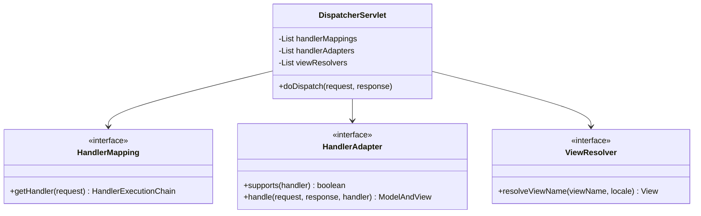
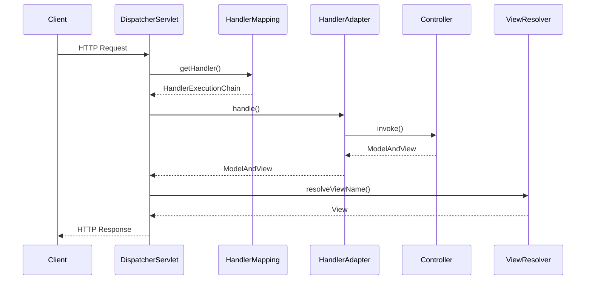

# 第9章：Spring MVC的实现

## 1. 问题引入：Web开发的困境

### 1.1 实际问题场景
在完成了第八章的事务管理后，小明开始开发网上商城的Web接口，他写出了这样的代码：

```java
public class ProductServlet extends HttpServlet {
    private ProductService productService;
    private ObjectMapper objectMapper = new ObjectMapper();
    
    @Override
    protected void doPost(HttpServletRequest request, HttpServletResponse response) 
            throws ServletException, IOException {
        try {
            // 问题代码1：请求参数解析
            BufferedReader reader = request.getReader();
            ProductDTO productDTO = objectMapper.readValue(reader, ProductDTO.class);
            
            // 问题代码2：参数校验
            if (productDTO.getName() == null || productDTO.getPrice() == null) {
                response.setStatus(HttpServletResponse.SC_BAD_REQUEST);
                return;
            }
            
            // 问题代码3：业务处理
            Product product = new Product();
            BeanUtils.copyProperties(productDTO, product);
            productService.createProduct(product);
            
            // 问题代码4：响应处理
            response.setContentType("application/json");
            response.setCharacterEncoding("UTF-8");
            objectMapper.writeValue(response.getWriter(), 
                new Result<>("success", product));
                
        } catch (Exception e) {
            // 问题代码5：异常处理
            response.setStatus(HttpServletResponse.SC_INTERNAL_SERVER_ERROR);
            objectMapper.writeValue(response.getWriter(), 
                new Result<>("error", e.getMessage()));
        }
    }
    
    // 问题代码6：URL映射
    @Override
    protected void doGet(HttpServletRequest request, HttpServletResponse response) 
            throws ServletException, IOException {
        String uri = request.getRequestURI();
        String method = request.getMethod();
        
        if ("/products".equals(uri) && "GET".equals(method)) {
            // 获取商品列表
            List<Product> products = productService.findAll();
            response.setContentType("application/json");
            objectMapper.writeValue(response.getWriter(), products);
        } else if ("/products/{id}".equals(uri) && "GET".equals(method)) {
            // 获取单个商品
            String id = uri.substring(uri.lastIndexOf("/") + 1);
            Product product = productService.findById(id);
            response.setContentType("application/json");
            objectMapper.writeValue(response.getWriter(), product);
        }
    }
}
```

这种方式存在以下问题：
1. URL映射繁琐且难以维护
2. 请求参数解析代码重复
3. 响应处理代码冗余
4. 异常处理分散
5. 视图渲染不灵活
6. 缺乏统一的拦截机制

### 1.2 问题分析

#### 1.2.1 Web层面临的挑战
```java
// 问题1：URL映射困难
if ("/api/v1/products".equals(uri)) {
    if ("GET".equals(method)) {
        // 获取商品列表
    } else if ("POST".equals(method)) {
        // 创建商品
    }
} else if (uri.matches("/api/v1/products/\\d+")) {
    if ("GET".equals(method)) {
        // 获取单个商品
    } else if ("PUT".equals(method)) {
        // 更新商品
    }
}

// 问题2：参数解析繁琐
String name = request.getParameter("name");
String priceStr = request.getParameter("price");
BigDecimal price = new BigDecimal(priceStr);
// 类型转换和校验...

// 问题3：视图渲染重复
response.setContentType("application/json");
response.setCharacterEncoding("UTF-8");
objectMapper.writeValue(response.getWriter(), result);
```

#### 1.2.2 业务层面临的挑战
```java
// 问题4：异常处理分散
try {
    // 业务逻辑
} catch (ValidationException e) {
    response.setStatus(400);
    // 错误响应
} catch (BusinessException e) {
    response.setStatus(500);
    // 错误响应
} catch (Exception e) {
    response.setStatus(500);
    // 错误响应
}

// 问题5：拦截器实现困难
public class SecurityFilter implements Filter {
    @Override
    public void doFilter(ServletRequest request, ServletResponse response,
            FilterChain chain) {
        // 安全检查
        // 如何优雅地处理登录、权限等横切关注点？
    }
}
```

## 2. 解决方案：Spring MVC框架

### 2.1 核心思路
1. 使用前端控制器统一请求入口
2. 实现灵活的URL映射机制
3. 提供强大的参数绑定能力
4. 支持多种视图技术
5. 统一的异常处理机制

### 2.2 整体设计

#### 2.2.1 类图


#### 2.2.2 时序图


## 3. 具体实现

### 3.1 前端控制器
```java
public class DispatcherServlet extends HttpServlet {
    private List<HandlerMapping> handlerMappings;
    private List<HandlerAdapter> handlerAdapters;
    private List<ViewResolver> viewResolvers;
    
    @Override
    protected void doDispatch(HttpServletRequest request, HttpServletResponse response) 
            throws Exception {
        HttpServletRequest processedRequest = request;
        HandlerExecutionChain mappedHandler = null;
        ModelAndView mv = null;
        
        try {
            // 1. 查找Handler
            mappedHandler = getHandler(processedRequest);
            if (mappedHandler == null) {
                noHandlerFound(processedRequest, response);
                return;
            }
            
            // 2. 查找HandlerAdapter
            HandlerAdapter ha = getHandlerAdapter(mappedHandler.getHandler());
            
            // 3. 执行前置拦截器
            if (!mappedHandler.applyPreHandle(processedRequest, response)) {
                return;
            }
            
            // 4. 执行处理器方法
            mv = ha.handle(processedRequest, response, mappedHandler.getHandler());
            
            // 5. 执行后置拦截器
            mappedHandler.applyPostHandle(processedRequest, response, mv);
            
        } catch (Exception ex) {
            processHandlerException(processedRequest, response, mappedHandler, ex);
        }
        
        // 6. 渲染视图
        processDispatchResult(processedRequest, response, mappedHandler, mv, null);
    }
}
```

### 3.2 处理器映射
```java
public class RequestMappingHandlerMapping implements HandlerMapping {
    private final Map<RequestMappingInfo, HandlerMethod> mappingLookup = 
            new LinkedHashMap<>();
            
    @Override
    public HandlerExecutionChain getHandler(HttpServletRequest request) {
        String lookupPath = getUrlPathHelper().getLookupPathForRequest(request);
        List<HandlerMethod> handlerMethods = lookupHandlerMethod(lookupPath, request);
        if (handlerMethods.isEmpty()) {
            return null;
        }
        
        HandlerMethod handlerMethod = getBestMatchingHandler(handlerMethods, request);
        HandlerExecutionChain chain = new HandlerExecutionChain(handlerMethod);
        chain.addInterceptors(getInterceptors(request));
        
        return chain;
    }
    
    protected void registerHandlerMethod(Object handler, Method method, 
            RequestMappingInfo mapping) {
        HandlerMethod handlerMethod = createHandlerMethod(handler, method);
        validateMethodMapping(handlerMethod, mapping);
        mappingLookup.put(mapping, handlerMethod);
    }
}
```

### 3.3 处理器适配器
```java
public class RequestMappingHandlerAdapter implements HandlerAdapter {
    private List<HandlerMethodArgumentResolver> argumentResolvers;
    private List<HandlerMethodReturnValueHandler> returnValueHandlers;
    
    @Override
    public boolean supports(Object handler) {
        return handler instanceof HandlerMethod;
    }
    
    @Override
    public ModelAndView handle(HttpServletRequest request,
            HttpServletResponse response, Object handler) throws Exception {
        return handleInternal(request, response, (HandlerMethod) handler);
    }
    
    protected ModelAndView handleInternal(HttpServletRequest request,
            HttpServletResponse response, HandlerMethod handlerMethod) 
            throws Exception {
        ModelAndView mav;
        // 检查方法和类级别的@ResponseBody注解
        if (hasResponseBody(handlerMethod)) {
            mav = handleResponseBody(handlerMethod, request, response);
        } else {
            mav = invokeHandlerMethod(request, response, handlerMethod);
        }
        return mav;
    }
}
```

## 4. 使用示例

### 4.1 基于注解的控制器
```java
@RestController
@RequestMapping("/api/products")
public class ProductController {
    @Autowired
    private ProductService productService;
    
    @GetMapping
    public List<Product> listProducts() {
        return productService.findAll();
    }
    
    @PostMapping
    public Result<Product> createProduct(@Valid @RequestBody ProductDTO dto) {
        Product product = new Product();
        BeanUtils.copyProperties(dto, product);
        return Result.success(productService.createProduct(product));
    }
    
    @GetMapping("/{id}")
    public Result<Product> getProduct(@PathVariable String id) {
        return Result.success(productService.findById(id));
    }
    
    @ExceptionHandler(ProductNotFoundException.class)
    public ResponseEntity<Result<?>> handleProductNotFound(ProductNotFoundException e) {
        return ResponseEntity.status(HttpStatus.NOT_FOUND)
                .body(Result.error(e.getMessage()));
    }
}
```

### 4.2 自定义参数解析器
```java
public class CurrentUserArgumentResolver implements HandlerMethodArgumentResolver {
    @Override
    public boolean supportsParameter(MethodParameter parameter) {
        return parameter.hasParameterAnnotation(CurrentUser.class);
    }
    
    @Override
    public Object resolveArgument(MethodParameter parameter,
            ModelAndViewContainer mavContainer, NativeWebRequest webRequest,
            WebDataBinderFactory binderFactory) throws Exception {
        HttpServletRequest request = webRequest.getNativeRequest(
                HttpServletRequest.class);
        String token = request.getHeader("Authorization");
        return userService.getCurrentUser(token);
    }
}
```

## 5. 与Spring MVC的对比

### 5.1 相同点
1. 基于DispatcherServlet的前端控制器模式
2. 使用HandlerMapping进行请求映射
3. 采用HandlerAdapter处理请求
4. 支持视图解析和渲染
5. 提供统一的异常处理机制

### 5.2 不同点
1. Spring MVC功能更加完善
2. Spring MVC提供更多的扩展点
3. Spring MVC支持更多的视图技术
4. Spring MVC有更完善的类型转换体系

## 6. 常见面试题

### 6.1 Spring MVC的执行流程是什么？
1. 请求到达DispatcherServlet
2. 通过HandlerMapping查找Handler
3. 通过HandlerAdapter调用Handler
4. Handler处理请求并返回ModelAndView
5. 通过ViewResolver解析视图
6. 渲染视图并返回响应

### 6.2 Spring MVC的主要组件有哪些？
1. DispatcherServlet：前端控制器
2. HandlerMapping：处理器映射
3. HandlerAdapter：处理器适配器
4. ViewResolver：视图解析器
5. HandlerExceptionResolver：异常处理器

### 6.3 @RequestMapping的原理是什么？
1. 启动时扫描带有@RequestMapping的方法
2. 解析注解的URL、请求方法等信息
3. 构建RequestMappingInfo对象
4. 注册到HandlerMapping中
5. 请求时根据URL等信息查找对应的Handler

## 7. 实践练习

### 7.1 基础练习
1. 实现一个简单的REST接口，包含基本的CRUD操作
2. 实现统一的异常处理，支持业务异常和系统异常的区分处理

### 7.2 进阶练习
1. 实现一个自定义的参数解析器，支持当前登录用户信息的自动注入
2. 实现一个简单的拦截器，用于登录校验

## 8. 总结与展望

### 8.1 本章总结
本章我们实现了一个简化版的Spring MVC框架，包括：
1. 基于DispatcherServlet的前端控制器模式
2. 灵活的HandlerMapping机制
3. 可扩展的HandlerAdapter体系
4. 统一的异常处理方案
5. 支持多种视图技术的ViewResolver

通过这些实现，我们解决了传统Web开发中的以下问题：
1. URL映射繁琐的问题
2. 参数解析和绑定的问题
3. 视图渲染不灵活的问题
4. 异常处理分散的问题

### 8.2 下一步展望
在下一章中，我们将探讨Spring框架的扩展机制，包括：
1. BeanFactoryPostProcessor的实现原理
2. BeanPostProcessor的处理流程
3. ImportBeanDefinitionRegistrar的应用场景
4. 条件注解的实现方式

通过学习这些扩展机制，我们将理解Spring框架的可扩展性设计，为后续开发自定义功能打下基础。 