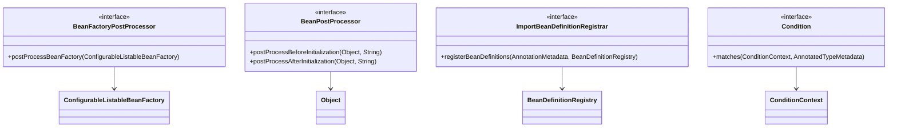

# 第10章：Spring框架的扩展机制

## 1. 问题引入：框架扩展的困境

### 1.1 实际问题场景
在完成了第九章的MVC框架后，小明在开发一个配置中心功能时遇到了新的问题：

```java
@Configuration
public class AppConfig {
    @Bean
    public UserService userService() {
        // 问题代码1：配置属性硬编码
        UserService userService = new UserService();
        userService.setMaxUsers(100);
        userService.setTimeout(3000);
        return userService;
    }
    
    @Bean
    public OrderService orderService() {
        // 问题代码2：条件判断散落各处
        if (isDevelopment()) {
            return new MockOrderService();
        }
        return new RealOrderService();
    }
    
    // 问题代码3：重复的注册逻辑
    @Bean
    public ProductService productService() {
        ProductService service = new ProductService();
        // 初始化配置
        service.setConfig(loadConfig());
        // 注册监听器
        service.addListener(new ProductChangeListener());
        return service;
    }
    
    @Bean
    public LogService logService() {
        LogService service = new LogService();
        // 同样的配置加载
        service.setConfig(loadConfig());
        // 同样的监听器注册
        service.addListener(new LogChangeListener());
        return service;
    }
    
    // 问题代码4：无法统一修改Bean
    private Config loadConfig() {
        // 如何在所有Bean实例化之前统一修改配置？
        return new Config();
    }
    
    // 问题代码5：组件注册不灵活
    private boolean isDevelopment() {
        // 如何根据不同条件动态注册组件？
        return true;
    }
}
```

这种方式存在以下问题：
1. 配置属性硬编码，难以动态修改
2. 条件判断逻辑分散，难以统一管理
3. Bean初始化代码重复
4. 无法在Bean生命周期的不同阶段进行统一处理
5. 组件注册不够灵活

### 1.2 问题分析

#### 1.2.1 Bean定义阶段的问题
```java
// 问题1：属性配置硬编码
@Bean
public DataSource dataSource() {
    DruidDataSource dataSource = new DruidDataSource();
    dataSource.setUrl("jdbc:mysql://localhost:3306/test");
    dataSource.setUsername("root");
    dataSource.setPassword("123456");
    return dataSource;
}

// 问题2：条件注册分散
@Bean
public CacheService cacheService() {
    if (redisAvailable()) {
        return new RedisCacheService();
    }
    return new LocalCacheService();
}
```

#### 1.2.2 Bean初始化阶段的问题
```java
// 问题3：初始化代码重复
@Bean
public Service1 service1() {
    Service1 service = new Service1();
    service.setEnvironment(environment);
    service.setConfig(loadConfig());
    service.init();
    return service;
}

@Bean
public Service2 service2() {
    Service2 service = new Service2();
    service.setEnvironment(environment);
    service.setConfig(loadConfig());
    service.init();
    return service;
}

// 问题4：无法统一处理
public interface InitializingBean {
    void afterPropertiesSet() throws Exception;
    // 如何在所有Bean初始化后做统一处理？
}
```

## 2. 解决方案：扩展机制的设计

### 2.1 核心思路
1. 提供Bean定义的修改机制
2. 实现Bean实例化的干预机制
3. 设计Bean初始化的扩展点
4. 支持条件化的组件注册
5. 提供Import机制实现模块化

### 2.2 整体设计

#### 2.2.1 类图


#### 2.2.2 时序图


## 3. 具体实现

### 3.1 BeanFactoryPostProcessor实现
```java
public interface BeanFactoryPostProcessor {
    void postProcessBeanFactory(ConfigurableListableBeanFactory beanFactory) 
            throws BeansException;
}

public class PropertyPlaceholderBeanFactoryPostProcessor 
        implements BeanFactoryPostProcessor {
    
    private Properties properties;
    
    @Override
    public void postProcessBeanFactory(
            ConfigurableListableBeanFactory beanFactory) throws BeansException {
        // 遍历所有Bean定义
        for (String beanName : beanFactory.getBeanDefinitionNames()) {
            BeanDefinition bd = beanFactory.getBeanDefinition(beanName);
            
            // 替换属性中的占位符
            PropertyValues pvs = bd.getPropertyValues();
            for (PropertyValue pv : pvs.getPropertyValues()) {
                if (pv.getValue() instanceof String) {
                    String value = (String) pv.getValue();
                    if (value.startsWith("${") && value.endsWith("}")) {
                        String key = value.substring(2, value.length() - 1);
                        value = properties.getProperty(key);
                        pvs.addPropertyValue(pv.getName(), value);
                    }
                }
            }
        }
    }
}
```

### 3.2 BeanPostProcessor实现
```java
public interface BeanPostProcessor {
    Object postProcessBeforeInitialization(Object bean, String beanName) 
            throws BeansException;
            
    Object postProcessAfterInitialization(Object bean, String beanName) 
            throws BeansException;
}

public class LoggingBeanPostProcessor implements BeanPostProcessor {
    @Override
    public Object postProcessBeforeInitialization(Object bean, String beanName) 
            throws BeansException {
        System.out.println("Bean '" + beanName + "' 开始初始化");
        return bean;
    }
    
    @Override
    public Object postProcessAfterInitialization(Object bean, String beanName) 
            throws BeansException {
        System.out.println("Bean '" + beanName + "' 完成初始化");
        return bean;
    }
}
```

### 3.3 ImportBeanDefinitionRegistrar实现
```java
public interface ImportBeanDefinitionRegistrar {
    void registerBeanDefinitions(
        AnnotationMetadata importingClassMetadata,
        BeanDefinitionRegistry registry);
}

public class ServiceRegistrar implements ImportBeanDefinitionRegistrar {
    @Override
    public void registerBeanDefinitions(
            AnnotationMetadata metadata, BeanDefinitionRegistry registry) {
        // 扫描特定包下的所有Service
        ClassPathBeanDefinitionScanner scanner = 
                new ClassPathBeanDefinitionScanner(registry);
        scanner.addIncludeFilter(new AnnotationTypeFilter(Service.class));
        scanner.scan("com.example.services");
    }
}
```

## 4. 使用示例

### 4.1 属性配置处理器
```java
@Configuration
public class AppConfig {
    @Bean
    public static PropertyPlaceholderBeanFactoryPostProcessor propertyProcessor() {
        PropertyPlaceholderBeanFactoryPostProcessor processor = 
                new PropertyPlaceholderBeanFactoryPostProcessor();
        processor.setProperties(loadProperties());
        return processor;
    }
    
    @Bean
    public DataSource dataSource() {
        DruidDataSource dataSource = new DruidDataSource();
        // 使用占位符替换配置
        dataSource.setUrl("${jdbc.url}");
        dataSource.setUsername("${jdbc.username}");
        dataSource.setPassword("${jdbc.password}");
        return dataSource;
    }
}
```

### 4.2 条件注册示例
```java
@Configuration
public class CacheConfig {
    @Bean
    @Conditional(RedisCondition.class)
    public CacheService redisCacheService() {
        return new RedisCacheService();
    }
    
    @Bean
    @Conditional(LocalCondition.class)
    public CacheService localCacheService() {
        return new LocalCacheService();
    }
}

public class RedisCondition implements Condition {
    @Override
    public boolean matches(ConditionContext context, 
            AnnotatedTypeMetadata metadata) {
        return context.getEnvironment()
                .getProperty("cache.type", "local")
                .equals("redis");
    }
}
```

## 5. 与Spring的对比

### 5.1 相同点
1. 基于接口的扩展机制设计
2. 遵循职责单一原则
3. 支持Bean生命周期的干预
4. 提供条件装配能力
5. 实现模块化的注册机制

### 5.2 不同点
1. Spring提供了更多的扩展点
2. Spring支持更复杂的条件判断
3. Spring有更完善的模块化机制
4. Spring提供了更多的内置实现

## 6. 常见面试题

### 6.1 BeanFactoryPostProcessor和BeanPostProcessor的区别是什么？
1. 作用时机不同：
   - BeanFactoryPostProcessor在Bean实例化之前修改Bean定义
   - BeanPostProcessor在Bean实例化后修改Bean实例
2. 使用场景不同：
   - BeanFactoryPostProcessor用于修改Bean配置信息
   - BeanPostProcessor用于修改Bean实例对象

### 6.2 Spring的扩展点有哪些？
1. BeanFactoryPostProcessor：修改Bean定义
2. BeanPostProcessor：修改Bean实例
3. ImportBeanDefinitionRegistrar：注册Bean定义
4. Condition：条件装配
5. ImportSelector：选择性导入配置

## 7. 实践练习

### 7.1 基础练习
1. 实现一个配置属性替换的BeanFactoryPostProcessor
2. 编写一个打印Bean初始化日志的BeanPostProcessor

### 7.2 进阶练习
1. 实现一个根据配置动态注册Bean的ImportBeanDefinitionRegistrar
2. 实现一个基于配置中心的动态配置刷新功能

## 8. 总结与展望

### 8.1 本章总结
本章我们实现了Spring框架的核心扩展机制，包括：
1. Bean定义的修改机制
2. Bean实例化的干预机制
3. 条件化的组件注册
4. 模块化的Bean注册机制

通过这些扩展机制，我们解决了以下问题：
1. 配置属性硬编码的问题
2. Bean初始化代码重复的问题
3. 组件注册不够灵活的问题
4. 无法统一处理Bean的问题

### 8.2 下一步展望
在下一章中，我们将探讨Spring框架的高级特性，包括：
1. 事件机制的实现
2. 国际化支持的实现
3. 资源加载机制的实现
4. 类型转换体系的实现

通过学习这些高级特性，我们将进一步理解Spring框架的设计理念，为构建企业级应用打下坚实基础。 