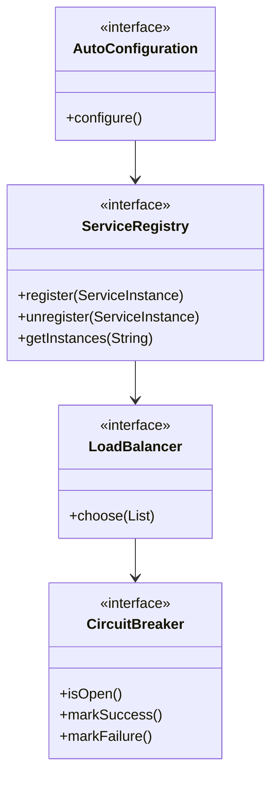
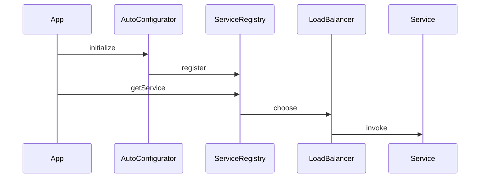

# 第11章：Spring集成机制

## 1. 问题引入：框架集成的困境

### 1.1 实际问题场景
在完成了第十章的扩展机制后，小明开始将系统改造为微服务架构，他遇到了以下问题：

```java
@Configuration
public class WebConfig {
    // 问题代码1：重复的配置代码
    @Bean
    public RestTemplate restTemplate() {
        RestTemplate restTemplate = new RestTemplate();
        // 配置连接池
        HttpComponentsClientHttpRequestFactory factory = 
            new HttpComponentsClientHttpRequestFactory();
        factory.setConnectTimeout(5000);
        factory.setReadTimeout(5000);
        restTemplate.setRequestFactory(factory);
        
        // 配置消息转换器
        MappingJackson2HttpMessageConverter converter = 
            new MappingJackson2HttpMessageConverter();
        converter.setSupportedMediaTypes(Arrays.asList(MediaType.APPLICATION_JSON));
        restTemplate.getMessageConverters().add(converter);
        
        return restTemplate;
    }
    
    // 问题代码2：硬编码的服务地址
    @Bean
    public UserClient userClient() {
        return new UserClient("http://localhost:8081");
    }
    
    // 问题代码3：手动注册每个微服务客户端
    @Bean
    public OrderClient orderClient() {
        return new OrderClient("http://localhost:8082");
    }
}

@Service
public class UserService {
    // 问题代码4：服务调用错误处理
    public User getUser(Long id) {
        try {
            return userClient.getUser(id);
        } catch (Exception e) {
            // 如何统一处理服务调用异常？
            log.error("调用用户服务失败", e);
            return null;
        }
    }
    
    // 问题代码5：分布式事务
    @Transactional
    public void createOrder(Order order) {
        // 扣减库存
        inventoryClient.deduct(order.getProductId(), order.getQuantity());
        // 创建订单
        orderClient.create(order);
        // 如果订单创建成功但库存扣减失败，如何回滚？
    }
}
```

这种方式存在以下问题：
1. 微服务配置代码重复
2. 服务地址硬编码
3. 服务注册发现不灵活
4. 分布式事务难以处理
5. 缺乏统一的服务治理

### 1.2 问题分析

#### 1.2.1 框架集成层面的挑战
```java
// 问题1：配置繁琐
@Configuration
public class MyBatisConfig {
    @Bean
    public SqlSessionFactory sqlSessionFactory() {
        SqlSessionFactoryBean factoryBean = new SqlSessionFactoryBean();
        factoryBean.setDataSource(dataSource());
        factoryBean.setMapperLocations(new PathMatchingResourcePatternResolver()
            .getResources("classpath:mapper/*.xml"));
        return factoryBean.getObject();
    }
}

// 问题2：启动流程复杂
public class Application {
    public static void main(String[] args) {
        // 1. 创建Spring上下文
        AnnotationConfigApplicationContext context = 
            new AnnotationConfigApplicationContext();
            
        // 2. 注册配置类
        context.register(AppConfig.class);
        context.register(WebConfig.class);
        context.register(MyBatisConfig.class);
        
        // 3. 刷新上下文
        context.refresh();
    }
}
```

#### 1.2.2 微服务架构的挑战
```java
// 问题3：服务发现
@FeignClient(name = "user-service")
public interface UserClient {
    @GetMapping("/users/{id}")
    User getUser(@PathVariable("id") Long id);
}

// 问题4：负载均衡
@LoadBalanced
@Bean
public RestTemplate restTemplate() {
    return new RestTemplate();
}

// 问题5：熔断降级
@HystrixCommand(fallbackMethod = "getDefaultUser")
public User getUser(Long id) {
    return restTemplate.getForObject(
        "http://user-service/users/" + id, User.class);
}
```

## 2. 解决方案：集成机制的设计

### 2.1 核心思路
1. 设计自动配置机制
2. 实现条件化配置
3. 提供服务注册发现
4. 支持负载均衡
5. 实现熔断降级

### 2.2 整体设计

#### 2.2.1 类图


#### 2.2.2 时序图


## 3. 具体实现

### 3.1 自动配置实现
```java
public class SpringBootApplication {
    public static ConfigurableApplicationContext run(Class<?> primarySource, 
            String... args) {
        // 1. 创建应用上下文
        AnnotationConfigApplicationContext context = 
            new AnnotationConfigApplicationContext();
        
        // 2. 注册配置类
        context.register(primarySource);
        
        // 3. 加载自动配置类
        loadAutoConfigurations(context);
        
        // 4. 刷新上下文
        context.refresh();
        
        return context;
    }
    
    private static void loadAutoConfigurations(AnnotationConfigApplicationContext context) {
        // 扫描META-INF/spring.factories
        List<String> autoConfigurations = loadFactoryNames();
        
        // 注册自动配置类
        for (String configuration : autoConfigurations) {
            context.register(Class.forName(configuration));
        }
    }
}
```

### 3.2 服务注册发现实现
```java
public interface ServiceRegistry {
    void register(ServiceInstance instance);
    void unregister(ServiceInstance instance);
    List<ServiceInstance> getInstances(String serviceId);
}

public class ZookeeperServiceRegistry implements ServiceRegistry {
    private final CuratorFramework client;
    
    @Override
    public void register(ServiceInstance instance) {
        String path = "/services/" + instance.getServiceId() + "/" + 
            instance.getInstanceId();
        byte[] data = serialize(instance);
        client.create().creatingParentsIfNeeded()
            .withMode(CreateMode.EPHEMERAL)
            .forPath(path, data);
    }
    
    @Override
    public List<ServiceInstance> getInstances(String serviceId) {
        String path = "/services/" + serviceId;
        List<String> children = client.getChildren().forPath(path);
        
        return children.stream()
            .map(child -> deserialize(client.getData()
                .forPath(path + "/" + child)))
            .collect(Collectors.toList());
    }
}
```

### 3.3 负载均衡实现
```java
public interface LoadBalancer {
    ServiceInstance choose(List<ServiceInstance> instances);
}

public class RoundRobinLoadBalancer implements LoadBalancer {
    private final AtomicInteger position = new AtomicInteger(0);
    
    @Override
    public ServiceInstance choose(List<ServiceInstance> instances) {
        if (instances.isEmpty()) {
            return null;
        }
        
        int pos = position.incrementAndGet() % instances.size();
        return instances.get(pos);
    }
}
```

## 4. 使用示例

### 4.1 自动配置示例
```java
@Configuration
@ConditionalOnClass(DataSource.class)
public class DataSourceAutoConfiguration {
    @Bean
    @ConditionalOnMissingBean
    public DataSource dataSource() {
        return new HikariDataSource();
    }
}

// 在META-INF/spring.factories中注册
org.springframework.boot.autoconfigure.EnableAutoConfiguration=\
com.example.DataSourceAutoConfiguration
```

### 4.2 服务调用示例
```java
@SpringBootApplication
@EnableDiscoveryClient
public class Application {
    @Bean
    @LoadBalanced
    public RestTemplate restTemplate() {
        return new RestTemplate();
    }
}

@Service
public class UserService {
    @Autowired
    private RestTemplate restTemplate;
    
    @HystrixCommand(fallbackMethod = "getDefaultUser")
    public User getUser(Long id) {
        return restTemplate.getForObject(
            "http://user-service/users/{id}", User.class, id);
    }
    
    public User getDefaultUser(Long id) {
        return new User(id, "默认用户");
    }
}
```

## 5. 与Spring的对比

### 5.1 相同点
1. 基于自动配置的设计理念
2. 遵循约定优于配置原则
3. 支持条件化配置
4. 提供扩展机制
5. 注重可维护性

### 5.2 不同点
1. Spring Boot提供了更完整的自动配置
2. Spring Cloud有更丰富的服务治理功能
3. 原生的服务注册发现机制
4. 完整的微服务解决方案

## 6. 常见面试题

### 6.1 Spring Boot的自动配置原理是什么？
1. 通过@EnableAutoConfiguration导入配置
2. 扫描META-INF/spring.factories文件
3. 加载AutoConfiguration类
4. 根据条件注解决定是否启用配置
5. 实例化并注册相关的Bean

### 6.2 Spring Cloud的核心组件有哪些？
1. 服务注册与发现：Eureka、Nacos
2. 负载均衡：Ribbon
3. 服务调用：Feign
4. 熔断降级：Hystrix
5. 配置中心：Config

## 7. 实践练习

### 7.1 基础练习
1. 实现一个简单的自动配置类
2. 编写一个基于ZooKeeper的服务注册中心

### 7.2 进阶练习
1. 实现一个自定义的负载均衡算法
2. 设计一个简单的服务熔断器

## 8. 总结与展望

### 8.1 本章总结
本章我们实现了Spring框架的集成机制，包括：
1. 自动配置的核心实现
2. 服务注册发现机制
3. 负载均衡的设计
4. 熔断降级的实现

通过这些机制，我们解决了以下问题：
1. 框架集成配置繁琐的问题
2. 服务注册发现不灵活的问题
3. 服务调用不可靠的问题
4. 分布式系统的治理问题

### 8.2 未来展望
1. 云原生技术的发展
2. 服务网格的应用
3. 响应式编程的普及
4. 微服务架构的演进

至此，我们完成了Spring框架的核心实现，从IoC容器到AOP，从事务管理到MVC，从扩展机制到框架集成，构建了一个完整的企业级应用开发框架。希望这个系列的教程能帮助你深入理解Spring的设计理念和实现原理。 